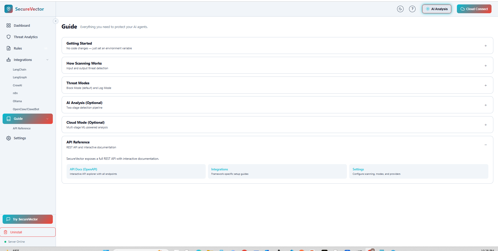

<div align="center">

<h1> SecureVector</h1>

<h3>Runtime Firewall for AI Agents & Bots</h3>

<p><strong>Block prompt injection, jailbreaks, and data leaks before they reach your AI.</strong></p>

<br>

[](https://opensource.org/licenses/Apache-2.0)
[](https://pypi.org/project/securevector-ai-monitor)
[](https://pypi.org/project/securevector-ai-monitor)
[](https://pepy.tech/project/securevector-ai-monitor)

[Website](https://securevector.io) · [Getting Started](docs/GETTING_STARTED.md) · [Local App Screenshots](#screenshots)

</div>

<br>

## How It Works


**SecureVector** sits between your AI agent and the LLM provider, scanning every request and response for security threats. Runs entirely on your machine — nothing leaves your infrastructure.

```bash
pip install securevector-ai-monitor[app]
securevector-app --web
```

Or download: [Windows](https://github.com/Secure-Vector/securevector-ai-threat-monitor/releases/download/v2.1.3/SecureVector-v2.1.3-Windows-Setup.exe) · [macOS](https://github.com/Secure-Vector/securevector-ai-threat-monitor/releases/download/v2.1.3/SecureVector-2.1.3-macOS.dmg) · [Linux](https://github.com/Secure-Vector/securevector-ai-threat-monitor/releases/download/v2.1.3/SecureVector-2.1.3-x86_64.AppImage) · [DEB](https://github.com/Secure-Vector/securevector-ai-threat-monitor/releases/download/v2.1.3/securevector_2.1.3_amd64.deb) · [RPM](https://github.com/Secure-Vector/securevector-ai-threat-monitor/releases/download/v2.1.3/securevector-2.1.3-1.x86_64.rpm)

> **Open-source. 100% local by default. No API keys required.**

<br>

## Highlights

- ☑ **100% Local by Default** — No data transmitted externally. Complete privacy.
- ☑ **Agents Protected** — LangChain, LangGraph, CrewAI, n8n, OpenClaw, and any OpenAI-compatible app.
- ☑ **Input Scanning** — Block prompt injection, jailbreaks, and manipulation before they reach the LLM.
- ☑ **Output Scanning** — Detect credential leaks, PII exposure, and system prompt disclosure.
- ☑ **13 Providers** — OpenAI, Anthropic, Gemini, Ollama, Groq, DeepSeek, Mistral, xAI, Together, Cohere, Cerebras, and more.
- ☑ **Full Visibility** — Real-time dashboard shows every threat, who sent it, and what was blocked.
- ☑ **Protect Your API Account** — Block abuse before it triggers ToS violations or key suspension.
- ☑ **One Command** — `securevector-app --web` and follow the UI to start protecting.

<br>

## What SecureVector Catches

1. **Your API account is the real target.** One successful jailbreak generating prohibited content gets your key suspended. All your users lose service.

2. **You have zero visibility.** Without SecureVector, you don't know who's abusing your app until OpenAI sends you a ToS violation notice.

3. **LLMs can't police their own output.** When your bot has access to user data, it doesn't know what's sensitive. SecureVector catches leaked credentials, PII, and system prompts in responses.

4. **Blocked requests are free requests.** Junk gets stopped locally in ~50ms — you never pay the API for processing it.

**Example:** You built an image generation app with 100 users on DALL-E 3 ($0.04/image). Ten users discover they can jailbreak your bot and start generating free images for fun — 20 junk requests/day each. That's 200 × $0.04 × 30 = **$240/month in abuse.** SecureVector blocks them all locally for $0.

<br>

## Install

### Option 1: pip

**Requires:** Python 3.9+ (MCP requires 3.10+)

```bash
pip install securevector-ai-monitor[app]
securevector-app --web
```

### Option 2: Binary installers

No Python required. Download and run.

| Platform | Download |
|----------|----------|
| Windows | [SecureVector-v2.1.3-Windows-Setup.exe](https://github.com/Secure-Vector/securevector-ai-threat-monitor/releases/download/v2.1.3/SecureVector-v2.1.3-Windows-Setup.exe) |
| macOS | [SecureVector-2.1.3-macOS.dmg](https://github.com/Secure-Vector/securevector-ai-threat-monitor/releases/download/v2.1.3/SecureVector-2.1.3-macOS.dmg) |
| Linux (AppImage) | [SecureVector-2.1.3-x86_64.AppImage](https://github.com/Secure-Vector/securevector-ai-threat-monitor/releases/download/v2.1.3/SecureVector-2.1.3-x86_64.AppImage) |
| Linux (DEB) | [securevector_2.1.3_amd64.deb](https://github.com/Secure-Vector/securevector-ai-threat-monitor/releases/download/v2.1.3/securevector_2.1.3_amd64.deb) |
| Linux (RPM) | [securevector-2.1.3-1.x86_64.rpm](https://github.com/Secure-Vector/securevector-ai-threat-monitor/releases/download/v2.1.3/securevector-2.1.3-1.x86_64.rpm) |

[All Releases](https://github.com/Secure-Vector/securevector-ai-threat-monitor/releases) · [SHA256 Checksums](https://github.com/Secure-Vector/securevector-ai-threat-monitor/releases/download/v2.1.3/SHA256SUMS.txt)

> **Security:** Only download installers from this official GitHub repository. Always verify SHA256 checksums before installation. SecureVector is not responsible for binaries obtained from third-party sources.

<br>

## Quick Start

**Step 1:** Start SecureVector app
- **Option 1:** Run `securevector-app --web` then open [http://localhost:8741](http://localhost:8741) in your browser.
- **Option 2:** Double-click the installed app if using a binary.

**Step 2:** In the left navigation, expand **Integrations** and choose your agent framework.

**Step 3:** Click **Start Multi-Provider Proxy** (recommended). Point your app to the proxy URL shown on the page.

That's it! Every request is scanned for prompt injection. Every response is scanned for data leaks.

**Supported providers (13):** `openai` `anthropic` `gemini` `ollama` `groq` `deepseek` `mistral` `xai` `together` `cohere` `cerebras` `moonshot` `minimax`

<br>

## Agent Integrations

| Agent/Framework | Integration |
|-----------------|-------------|
| **LangChain** | LLM Proxy or [SDK Callback](docs/USECASES.md#langchain) |
| **LangGraph** | LLM Proxy or [Security Node](docs/USECASES.md#langgraph) |
| **CrewAI** | LLM Proxy or [SDK Callback](docs/USECASES.md#crewai) |
| **Any OpenAI-compatible** | LLM Proxy — see Integrations in UI |
| **OpenClaw / ClaudBot** | LLM Proxy — see Integrations in UI |
| **n8n** | [Community Node](docs/USECASES.md#n8n) |
| **Claude Desktop** | [MCP Server Guide](docs/MCP_GUIDE.md) |
| **Any OpenAI-compatible app** | LLM Proxy — set `OPENAI_BASE_URL` to proxy |
| **Any HTTP Client** | `POST http://localhost:8741/analyze` with `{"text": "..."}` |

<br>

## What It Detects

| Input Threats (User → LLM) | Output Threats (LLM → User) |
|---------------------------|----------------------------|
| Prompt injection | Credential leakage (API keys, tokens) |
| Jailbreak attempts | System prompt exposure |
| Data exfiltration requests | PII disclosure (SSN, credit cards) |
| Social engineering | Jailbreak success indicators |
| SQL injection patterns | Encoded malicious content |

Full coverage: [OWASP LLM Top 10](https://owasp.org/www-project-top-10-for-large-language-model-applications/)

<br>

## Screenshots

<table>
<tr>
<td><br><em>Dashboard — stats, risk distribution, recent threats</em></td>
<td><br><em>Threat Analytics — blocked, redacted, logged</em></td>
</tr>
<tr>
<td><br><em>Integrations — LangChain, Ollama, OpenClaw, and more</em></td>
<td><br><em>Detection Rules — community rules, or create your own for your use case or industry</em></td>
</tr>
<tr>
<td><br><em>Getting Started — onboarding guide with setup steps</em></td>
</tr>
</table>

<br>

## Documentation

- [Installation Guide](docs/INSTALLATION.md) — Binary installers, pip, service setup
- [Use Cases & Examples](docs/USECASES.md) — LangChain, LangGraph, CrewAI, n8n, FastAPI
- [MCP Server Guide](docs/MCP_GUIDE.md) — Claude Desktop, Cursor integration
- [API Reference](docs/API_SPECIFICATION.md) — REST API endpoints
- [Security Policy](.github/SECURITY.md) — Vulnerability disclosure

<br>

## Editions

### Other install options

| Install | Use Case | Size |
|---------|----------|------|
| `pip install securevector-ai-monitor` | **SDK only** — lightweight, for programmatic integration | ~18MB |
| `pip install securevector-ai-monitor[mcp]` | **MCP server** — Claude Desktop, Cursor | ~38MB |

### Open Source vs Cloud

| Open Source (100% Free) | Cloud (Optional) |
|-------------------------|------------------|
| Apache 2.0 license | Expert-curated rule library |
| Community detection rules | Multi-stage ML threat analysis |
| Custom YAML rules | Real-time cloud dashboard |
| 100% local by default, no data sharing | Team collaboration |
| Desktop app + local API | Priority support |

> **Cloud is optional.** SecureVector runs entirely locally by default. Connect to [app.securevector.io](https://app.securevector.io) only if you want enterprise-grade threat intelligence with specialized algorithms designed to minimize false positives.

[**Try Free**](https://app.securevector.io)

<br>

## Update

| Method | Command |
|--------|---------|
| **PyPI** | `pip install --upgrade securevector-ai-monitor[app]` |
| **Source** | `git pull && pip install -e ".[app]"` |
| **Windows** | Download latest [.exe installer](https://github.com/Secure-Vector/securevector-ai-threat-monitor/releases/latest) and run it (overwrites previous version) |
| **macOS** | Download latest [.dmg](https://github.com/Secure-Vector/securevector-ai-threat-monitor/releases/latest), drag to Applications (replace existing) |
| **Linux AppImage** | Download latest [.AppImage](https://github.com/Secure-Vector/securevector-ai-threat-monitor/releases/latest) and replace the old file |
| **Linux DEB** | `sudo dpkg -i securevector_<version>_amd64.deb` |
| **Linux RPM** | `sudo rpm -U securevector-<version>.x86_64.rpm` |

After updating, restart SecureVector.

<br>

## Contributing

```bash
git clone https://github.com/Secure-Vector/securevector-ai-threat-monitor.git
cd securevector-ai-threat-monitor
pip install -e ".[dev]"
pytest tests/ -v
```

[Contributing Guidelines](docs/legal/CONTRIBUTOR_AGREEMENT.md) · [Code of Conduct](.github/CODE_OF_CONDUCT.md)

<br>

## License

Apache License 2.0 — see [LICENSE](LICENSE).

**SecureVector** is a trademark of SecureVector. See [NOTICE](NOTICE).

---

<div align="center">

**[Get Started](#install)** · **[Documentation](https://docs.securevector.io)** · **[GitHub Issues](https://github.com/Secure-Vector/securevector-ai-threat-monitor/issues)** · **[security@securevector.io](mailto:security@securevector.io)**

</div>
