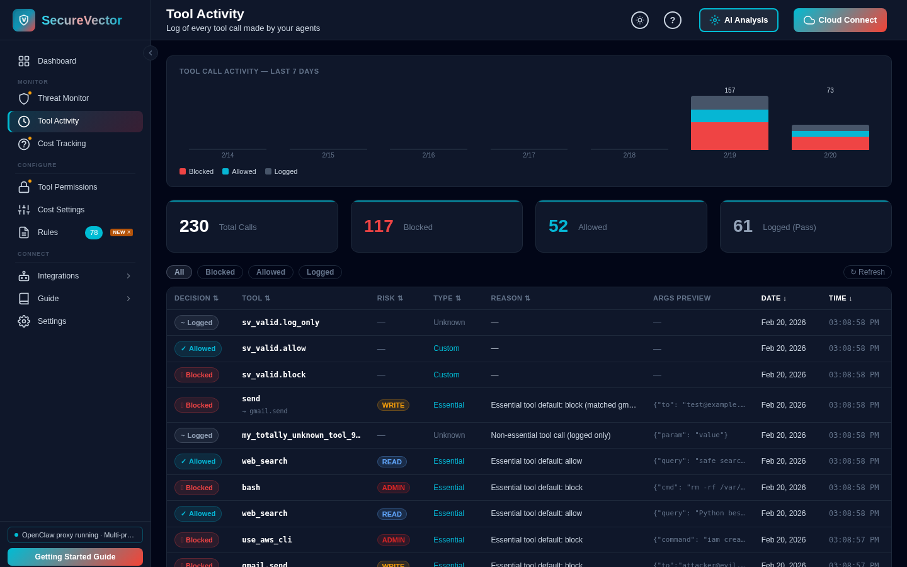
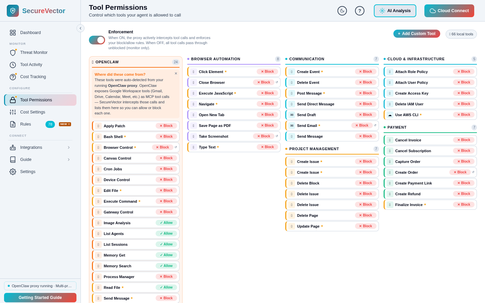
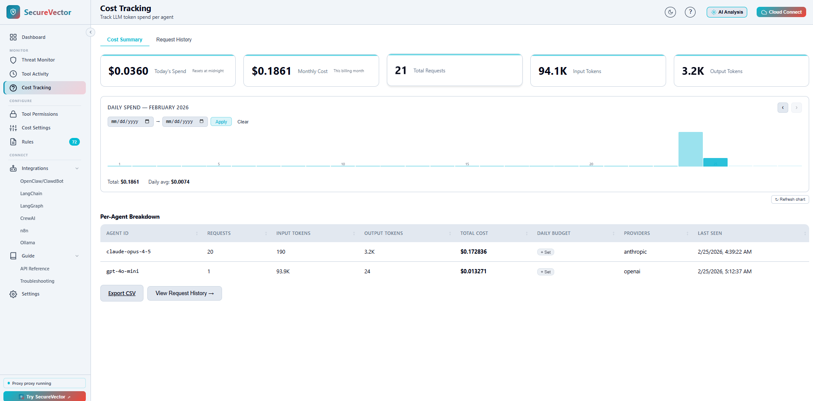
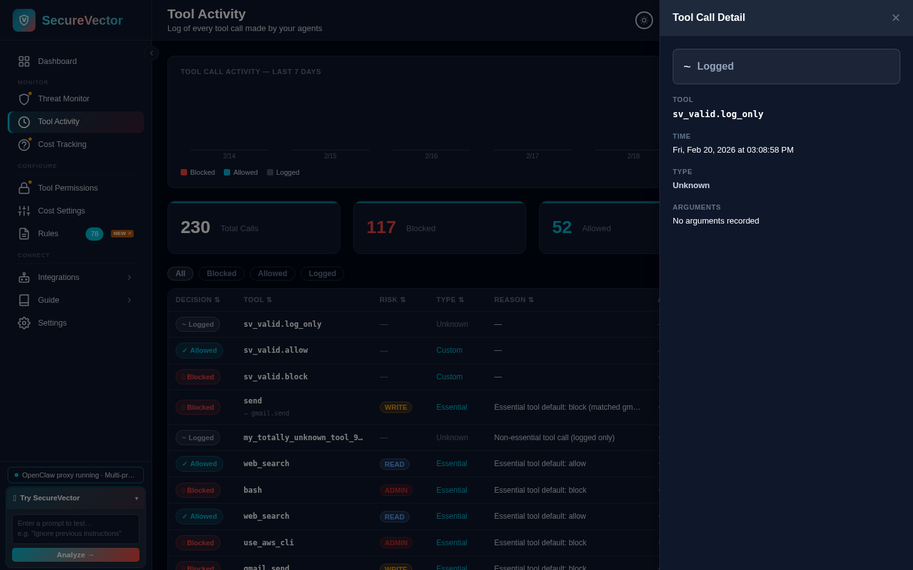

<div align="center">

<h1> SecureVector</h1>

<h3>AI Firewall for Agents — Block prompt injection, tool abuse, and data leaks before and after the LLM.</h3>

<p>Your AI agent is flying blind. SecureVector fixes that — block prompt injection, tool abuse, and data leaks, track every token, enforce budget limits, and keep a full audit trail.</p>

<p><strong>No coding required.</strong> Download the desktop app, point your AI agent at it — done. Or install with pip.</p>

<br>

[](https://opensource.org/licenses/Apache-2.0)
[](https://pypi.org/project/securevector-ai-monitor)
[](https://pypi.org/project/securevector-ai-monitor)
[](https://pepy.tech/project/securevector-ai-monitor)
[](https://discord.gg/k3bgZuCQBC)

[Website](https://securevector.io) · [Getting Started](docs/GETTING_STARTED.md) · [Discord](https://discord.gg/k3bgZuCQBC) · [Dashboard Screenshots](#screenshots)

</div>

<br>

<table>
<tr>
<th align="left" width="50%">The Problem</th>
<th align="left" width="50%">The Fix</th>
</tr>
<tr>
<td valign="top">

AI agents are powerful — and completely unprotected.

Every prompt your AI agent sends, every secret it handles, every piece of user data — goes straight to the LLM provider with nothing in between. No spend limit. No injection protection. No audit trail. You're flying blind.

- Developers have reported API bills of hundreds of dollars appearing in days from runaway agents
- Agent frameworks commonly ship with no budget enforcement, no PII filtering, and no permission model — a risk pattern flagged by MITRE and Gartner in their AI agent security research

You don't need an enterprise security team to fix this. You need SecureVector.

</td>
<td valign="top">

SecureVector runs on your machine, between your AI agents and LLM providers. It starts with an OpenClaw proxy by default and supports a multi-provider proxy mode for routing across OpenAI, Anthropic, Ollama, and more — all through a single endpoint. It intercepts defined tool calls, scans every prompt and response for injection and data leaks, and hard-stops agents that exceed their budget. 100% local by default. No accounts required.

</td>
</tr>
</table>

**Download :** [Windows](https://github.com/Secure-Vector/securevector-ai-threat-monitor/releases/download/v3.0.0/SecureVector-v3.0.0-Windows-Setup.exe) · [macOS](https://github.com/Secure-Vector/securevector-ai-threat-monitor/releases/download/v3.0.0/SecureVector-3.0.0-macOS.dmg) · [Linux](https://github.com/Secure-Vector/securevector-ai-threat-monitor/releases/download/v3.0.0/SecureVector-3.0.0-x86_64.AppImage) · [DEB](https://github.com/Secure-Vector/securevector-ai-threat-monitor/releases/download/v3.0.0/securevector_3.0.0_amd64.deb) · [RPM](https://github.com/Secure-Vector/securevector-ai-threat-monitor/releases/download/v3.0.0/securevector-3.0.0-1.x86_64.rpm)

**Or install with pip:**

```bash
pip install securevector-ai-monitor[app]
securevector-app --web
```

One command to install. One command to start. Point your app to `localhost:8742/{provider}/v1` instead of the provider's API — everything else stays the same. Zero code changes.

> **Open-source. 100% local by default. No API keys required.**

<br>

## Screenshots

<table>
<tr>
<td width="50%"><br><em>Tool Call History — 305 calls, 158 blocked: bash rm -rf, gmail_send to attacker, use_aws_cli stopped</em></td>
<td width="50%"><br><em>Agent Tool Permissions — allow or block tools by name or category</em></td>
</tr>
<tr>
<td width="50%"><br><em>Dashboard — threat counts, cost metrics, and tool permission status</em></td>
<td width="50%"><br><em>LLM Cost Tracker — per-agent spend, budgets, and token breakdown</em></td>
</tr>
<tr>
<td width="50%"><br><em>Tool Call Detail — click any row for full context: decision, tool, args, and timestamp</em></td>
<td width="50%"></td>
</tr>
</table>

<br>

## Why SecureVector?

| Without SecureVector | With SecureVector |
|---------------------|-------------------|
| Prompt injections pass straight through | Blocked before they reach the LLM |
| API keys and PII leak in prompts | Automatically redacted |
| No idea what agents are spending | Real-time cost tracking per agent |
| One runaway agent = surprise $500 bill | Hard budget limits with auto-stop |
| Zero visibility into agent traffic | Live dashboard showing everything |

<br>

## How It Works


**SecureVector** sits between your AI agent and the LLM provider, scanning every request and response for security threats, controlling tool permissions, and tracking spend in real time. Runs entirely on your machine — nothing leaves your infrastructure.

<br>

## Quick Start

**1. Install or download** — see [Install](#install) below for pip, binaries, and other options.

**2. Start**

```bash
securevector-app --web
```

Open [http://localhost:8741](http://localhost:8741) in your browser, or double-click the installed binary. If ports 8741/8742 are taken, use `--port <port>` of your choice — the proxy starts automatically on port+1.

**Configure** *(optional — defaults work out of the box)*

SecureVector writes `svconfig.yml` to your app data directory on first run. You can skip this entirely and configure everything from the UI instead. To set policy in code:

```yaml
# SecureVector Configuration
# Changes take effect on next restart.
# The config path is printed to the console when you start the app.
#
# Linux:   ~/.local/share/securevector/threat-monitor/svconfig.yml
# macOS:   ~/Library/Application Support/SecureVector/ThreatMonitor/svconfig.yml
# Windows: %LOCALAPPDATA%/SecureVector/ThreatMonitor/svconfig.yml

server:
  # Web UI / API server listen host and port.
  # Change these if port 8741 is already in use on your machine.
  # To listen on all interfaces (e.g. for LAN access), set host: 0.0.0.0
  host: 127.0.0.1
  port: 8741

security:
  # Block detected threats (true) or log/warn only (false)
  block_mode: true
  # Scan LLM responses for data leakage and PII
  output_scan: true

budget:
  # Daily spend limit in USD (set to null to disable)
  daily_limit: 5.00
  # Warn in logs/headers when spend approaches the limit
  warn: true
  # Block requests when the daily budget is exceeded
  block: true

tools:
  # Enforce tool permission rules (allow/block based on your rules)
  enforcement: true

proxy:
  # Setting mode here auto-starts the proxy when you run: securevector-app --web
  # No --proxy flag needed — proxy starts automatically with the settings below.
  #
  # Step 1: Start SecureVector  →  securevector-app --web
  # Step 2: Point your agent at the proxy instead of the LLM provider
  #
  #   Linux / macOS:  export OPENAI_BASE_URL=http://localhost:8742/openai/v1
  #                   export ANTHROPIC_BASE_URL=http://localhost:8742/anthropic
  #   Windows PS:     $env:OPENAI_BASE_URL="http://localhost:8742/openai/v1"
  #   Windows CMD:    set OPENAI_BASE_URL=http://localhost:8742/openai/v1
  #   Ollama/WebUI:   set API base URL to http://localhost:8742/ollama/v1
  #   OpenClaw:       ANTHROPIC_BASE_URL=http://localhost:8742/anthropic openclaw gateway
  integration: openclaw       # or: langchain, langgraph, crewai, ollama
  mode: multi-provider        # or: single (add provider: below)
  provider: null              # required only when mode is "single"
  host: 127.0.0.1             # proxy listen host (0.0.0.0 for LAN access)
  port: 8742                  # proxy listen port (default: server.port + 1)
```

The UI keeps this file in sync — changes in the dashboard are written back to `svconfig.yml` automatically.

**Use**

Point any application to SecureVector's proxy instead of the provider's API.

<table>
<tr>
<th align="left" width="50%">🪟 Windows</th>
<th align="left" width="50%">🐧 Linux / macOS</th>
</tr>
<tr>
<td valign="top">

**Command Prompt** (current session)
<pre>set OPENAI_BASE_URL=http://localhost:8742/openai/v1
set ANTHROPIC_BASE_URL=http://localhost:8742/anthropic</pre>

**PowerShell** (current session)
<pre>$env:OPENAI_BASE_URL="http://localhost:8742/openai/v1"
$env:ANTHROPIC_BASE_URL="http://localhost:8742/anthropic"</pre>

**PowerShell** (persistent, per user)
<pre>[Environment]::SetEnvironmentVariable(
  "OPENAI_BASE_URL",
  "http://localhost:8742/openai/v1",
  "User"
)</pre>

</td>
<td valign="top">

**Terminal** (current session)
<pre>export OPENAI_BASE_URL=http://localhost:8742/openai/v1
export ANTHROPIC_BASE_URL=http://localhost:8742/anthropic</pre>

**Persistent** (add to `~/.bashrc` or `~/.zshrc`)
<pre>echo 'export OPENAI_BASE_URL=http://localhost:8742/openai/v1' >> ~/.bashrc
echo 'export ANTHROPIC_BASE_URL=http://localhost:8742/anthropic' >> ~/.bashrc
source ~/.bashrc</pre>

</td>
</tr>
</table>

Every request is scanned for prompt injection. Every response is scanned for data leaks. Every dollar is tracked.

**Supported providers (13):** `openai` `anthropic` `gemini` `ollama` `groq` `deepseek` `mistral` `xai` `together` `cohere` `cerebras` `moonshot` `minimax`

<br>

## What You Get

<table>
<tr>
<th align="left" width="50%">Threat Protection</th>
<th align="left" width="50%">Cost Control</th>
</tr>
<tr>
<td valign="top">

Scans every prompt and response for prompt injection, jailbreaks, PII leaks, and tool abuse. 50+ detection rules covering the OWASP LLM Top 10. Blocks threats before they reach the LLM.

</td>
<td valign="top">

Tracks every token and dollar per agent in real time. Set daily budget limits — requests auto-stop when the cap is hit. Never wake up to a surprise bill.

</td>
</tr>
<tr>
<th align="left">Full Visibility</th>
<th align="left">100% Local</th>
</tr>
<tr>
<td valign="top">

Live dashboard showing every LLM request, tool call, token count, and threat event. See exactly what your agents are doing.

</td>
<td valign="top">

Runs entirely on your machine. No accounts. No cloud. No data leaves your infrastructure. Open source under Apache 2.0.

</td>
</tr>
</table>

<br>

## Features

| Section | Feature | Description |
|---------|---------|-------------|
| **Monitor** | Threat Monitor | Live feed of every detected threat — prompt injection, jailbreaks, data leaks, tool abuse |
| | Tool Activity | Full audit log of every tool call your agents make, with args, decision, and timestamp |
| | Cost Tracking | Per-agent, per-model token spend and USD cost in real time, with request history |
| **Configure** | Tool Permissions | Allow or block specific tools by name or category — per agent, per rule |
| | Cost Settings | Set daily budget limits and choose whether to warn or hard-block at the cap |
| | Rules | Custom detection rules — auto-block or alert on threats matching your criteria |

**Performance:** Rule-based analysis (default) adds ~10–50ms per request. Enabling optional AI analysis adds 1–3s per request depending on the model and provider — this is shown on the dashboard so you can measure it against your actual traffic.

<br>

## Works With Everything

**Your AI Stack**

LangChain · LlamaIndex · CrewAI · AutoGen · LangGraph · n8n · Dify · OpenClaw/ClawdBot *(LLM gateway agent framework)* — or any framework that makes HTTP calls to an LLM provider.

**LLM Providers**

OpenAI · Anthropic · Ollama · Groq · and any OpenAI-compatible API.

**Run Anywhere**

| Environment | Details |
|-------------|---------|
| Local | macOS, Linux, Windows |
| Cloud | AWS, GCP, Azure |
| Containers | Docker & Kubernetes |
| Virtual Machines | EC2, Droplets, VMs |
| Edge / Serverless | Lambda, Workers, Vercel |

## Agent Integrations

| Agent/Framework | Integration |
|-----------------|-------------|
| **LangChain** | LLM Proxy or [SDK Callback](docs/USECASES.md#langchain) |
| **LangGraph** | LLM Proxy or [Security Node](docs/USECASES.md#langgraph) |
| **CrewAI** | LLM Proxy or [SDK Callback](docs/USECASES.md#crewai) |
| **Any OpenAI-compatible** | LLM Proxy — see Integrations in UI |
| **OpenClaw / ClawdBot** *(LLM gateway agent)* | LLM Proxy — see Integrations in UI |
| **n8n** | [Community Node](docs/USECASES.md#n8n) |
| **Claude Desktop** | [MCP Server Guide](docs/MCP_GUIDE.md) |
| **Any OpenAI-compatible app** | LLM Proxy — set `OPENAI_BASE_URL` to proxy |
| **Any HTTP Client** | `POST http://localhost:8741/analyze` with `{"text": "..."}` |

<br>

## What It Detects

| Input Threats (User to LLM) | Output Threats (LLM to User) |
|-----------------------------|------------------------------|
| Prompt injection | Credential leakage (API keys, tokens) |
| Jailbreak attempts | System prompt exposure |
| Data exfiltration requests | PII disclosure (SSN, credit cards) |
| Social engineering | Jailbreak success indicators |
| SQL injection patterns | Encoded malicious content |
| Tool result injection (MCP) | — |
| Multi-agent authority spoofing | — |
| Permission scope escalation | — |

Full coverage: [OWASP LLM Top 10](https://owasp.org/www-project-top-10-for-large-language-model-applications/)

### AI Agent Attack Protection (28 new rules · 78 total)

Built from real attack chains observed against production agent frameworks:

- **Tool Result Injection** — injected instructions hidden inside MCP tool responses
- **Multi-Agent Authority Spoofing** — impersonating trusted agents in multi-agent pipelines
- **Permission Scope Escalation** — agents requesting more permissions than granted
- **MCP Tool Call Injection** — malicious payloads delivered through MCP tool calls
- **Evasion techniques** (22 rules) — zero-width characters, encoding tricks, roleplay framing, leetspeak, semantic inversion, emotional manipulation, and more

<br>

## Open Source

SecureVector is fully open source. No cloud required. No accounts. No tracking. Run it, fork it, contribute to it.

**Built for** solo developers and small teams who ship AI agents without a security team or a FinOps budget. If you are building with LangChain, CrewAI, OpenClaw, or any agent framework — and you do not have someone watching your agent traffic and API spend — SecureVector is for you.

## Open Source vs Cloud

| Open Source (100% Free) | Cloud (Optional) |
|-------------------------|------------------|
| Apache 2.0 license | Expert-curated rule library |
| Community detection rules | Multi-stage ML threat analysis |
| Custom YAML rules | Real-time cloud dashboard |
| 100% local by default, no data sharing | Team collaboration |
| Desktop app + local API | Priority support |

> **Cloud is optional.** SecureVector runs entirely locally by default. Connect to [app.securevector.io](https://app.securevector.io) only if you want enterprise-grade threat intelligence with specialized algorithms designed to minimize false positives.

[**Try Free**](https://app.securevector.io)

<br>

## Install

### Option 1: pip

**Requires:** Python 3.9+ (MCP requires 3.10+)

```bash
pip install securevector-ai-monitor[app]
securevector-app --web
```

### Option 2: Binary installers

No Python required. Download and run.

| Platform | Download |
|----------|----------|
| Windows | [SecureVector-v3.0.0-Windows-Setup.exe](https://github.com/Secure-Vector/securevector-ai-threat-monitor/releases/download/v3.0.0/SecureVector-v3.0.0-Windows-Setup.exe) |
| macOS | [SecureVector-3.0.0-macOS.dmg](https://github.com/Secure-Vector/securevector-ai-threat-monitor/releases/download/v3.0.0/SecureVector-3.0.0-macOS.dmg) |
| Linux (AppImage) | [SecureVector-3.0.0-x86_64.AppImage](https://github.com/Secure-Vector/securevector-ai-threat-monitor/releases/download/v3.0.0/SecureVector-3.0.0-x86_64.AppImage) |
| Linux (DEB) | [securevector_3.0.0_amd64.deb](https://github.com/Secure-Vector/securevector-ai-threat-monitor/releases/download/v3.0.0/securevector_3.0.0_amd64.deb) |
| Linux (RPM) | [securevector-3.0.0-1.x86_64.rpm](https://github.com/Secure-Vector/securevector-ai-threat-monitor/releases/download/v3.0.0/securevector-3.0.0-1.x86_64.rpm) |

[All Releases](https://github.com/Secure-Vector/securevector-ai-threat-monitor/releases) · [SHA256 Checksums](https://github.com/Secure-Vector/securevector-ai-threat-monitor/releases/download/v3.0.0/SHA256SUMS.txt)

> **Security:** Only download installers from this official GitHub repository. Always verify SHA256 checksums before installation. SecureVector is not responsible for binaries obtained from third-party sources.

### Other install options

| Install | Use Case | Size |
|---------|----------|------|
| `pip install securevector-ai-monitor` | **SDK only** — lightweight, for programmatic integration | ~18MB |
| `pip install securevector-ai-monitor[app]` | **Full app** — web UI, LLM proxy, cost tracking, tool permissions | 453 KB wheel · ~16 MB total on disk (incl. dependencies) |
| `pip install securevector-ai-monitor[mcp]` | **MCP server** — Claude Desktop, Cursor | ~38MB |

<br>

## Update

| Method | Command |
|--------|---------|
| **PyPI** | `pip install --upgrade securevector-ai-monitor[app]` |
| **Source** | `git pull && pip install -e ".[app]"` |
| **Windows** | Download latest [.exe installer](https://github.com/Secure-Vector/securevector-ai-threat-monitor/releases/latest) and run it (overwrites previous version) |
| **macOS** | Download latest [.dmg](https://github.com/Secure-Vector/securevector-ai-threat-monitor/releases/latest), drag to Applications (replace existing) |
| **Linux AppImage** | Download latest [.AppImage](https://github.com/Secure-Vector/securevector-ai-threat-monitor/releases/latest) and replace the old file |
| **Linux DEB** | `sudo dpkg -i securevector_<version>_amd64.deb` |
| **Linux RPM** | `sudo rpm -U securevector-<version>.x86_64.rpm` |

After updating, restart SecureVector.

<br>

## Documentation

- [Installation Guide](docs/INSTALLATION.md) — Binary installers, pip, service setup
- [Use Cases & Examples](docs/USECASES.md) — LangChain, LangGraph, CrewAI, n8n, FastAPI
- [MCP Server Guide](docs/MCP_GUIDE.md) — Claude Desktop, Cursor integration
- [API Reference](docs/API_SPECIFICATION.md) — REST API endpoints
- [Security Policy](.github/SECURITY.md) — Vulnerability disclosure

<br>

## Contributing

```bash
git clone https://github.com/Secure-Vector/securevector-ai-threat-monitor.git
cd securevector-ai-threat-monitor
pip install -e ".[dev]"
pytest tests/ -v
```

[Contributing Guidelines](docs/legal/CONTRIBUTOR_AGREEMENT.md) · [Code of Conduct](.github/CODE_OF_CONDUCT.md)

## Compatibility Notes

| Issue | Resolution |
|-------|------------|
| Python 3.9: `dict \| None` union type syntax requires Python 3.10+ | Changed to `Optional[dict]` from `typing` in test files |
| `fastapi` missing from `[dev]` extras — FastAPI test client unavailable in CI | Added `fastapi>=0.100.0` and `httpx>=0.24.0` to `[dev]` in `setup.py` |
| CodeQL: API key exposed via exception URL in log output | Changed `logger.error(f"...{e}")` to log exception type only, avoiding Gemini `key=` query param |

<br>

## License

Apache License 2.0 — see [LICENSE](LICENSE).

**SecureVector** is a trademark of SecureVector. See [NOTICE](NOTICE).

---

<div align="center">

**[Get Started](#install)** · **[Documentation](https://docs.securevector.io)** · **[Discord](https://discord.gg/k3bgZuCQBC)** · **[GitHub Issues](https://github.com/Secure-Vector/securevector-ai-threat-monitor/issues)** · **[security@securevector.io](mailto:security@securevector.io)**

</div>
