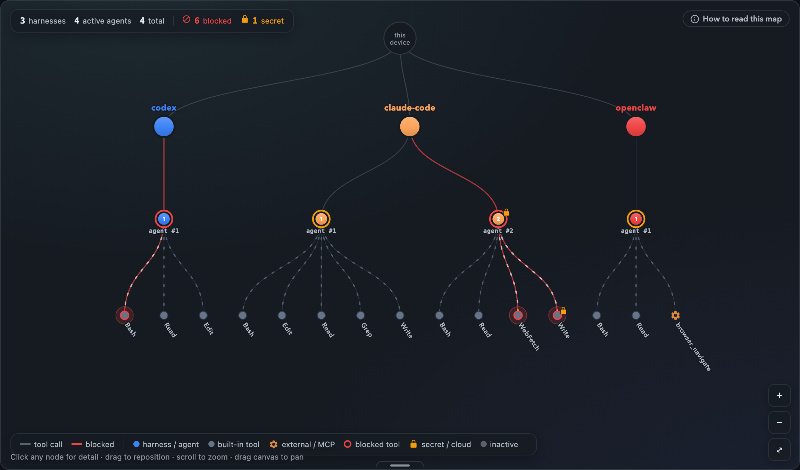
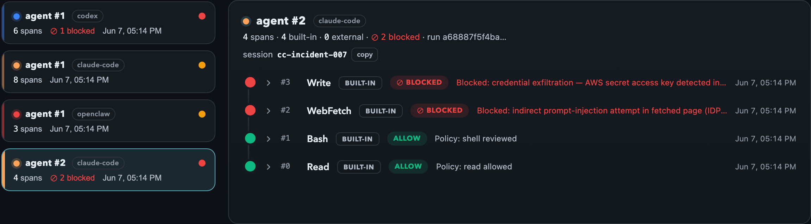

<div align="center">

<h1> SecureVector</h1>

<h3>Security &amp; Observability for AI Agents</h3>

<p><em>Audit every tool. Catch the threats. All locally.</em></p>

</div>

- **SecureVector Guard for Cursor** *(new in v4.7.0)* — native plugin + hooks for the Cursor agent: real-time allow / deny / ask enforcement, tamper-evident audit, and prompt-injection scanning, on the same Agent Map as your other harnesses.
- **Guardian ML threat detection** — a local, offline ML model runs alongside the regex rules and catches obfuscated, paraphrased, buried, or encoded attacks literal patterns miss. On by default, sub-millisecond, fail-open — nothing leaves your machine. [Details ↓](#optional-ml-detection-layer--securevector-guardian)
- **Tamper-evident audit chain** — every tool call appended to a SHA-256 hash-chained log, verifiable from the Tool Activity tab.
- **Allow / deny / ask at agent runtime** — enforced via PreToolUse hooks (Claude Code, OpenAI Codex, OpenClaw) or the multi-provider proxy, not just on a proxy.
- **72 detection rules** covering the OWASP LLM Top 10 + 28 agent-attack chains — prompt injection, jailbreaks, credential exfiltration, PII disclosure.
- **Monitor by default, opt-in block mode** — drop-in observability with no breakage risk; flip block mode when ready.
- **Token + cost tracking** — per-agent, per-model spend in real time.
- **Works with** Claude Code, OpenAI Codex, MCP, OpenClaw, LangChain, CrewAI, Ollama, n8n, and any HTTP-speaking LLM.
- **Apache 2.0, no signup** — runs on your machine; `pip install` and you're covered in 60 seconds.

**Five native agent plugins — zero proxy, allow / deny / ask enforced inline:**

| Plugin | Runtime | Hooks | Audit `runtime_kind` |
|---|---|---|---|
| **SecureVector Guard for Claude Code** | Anthropic Claude Code CLI | `PreToolUse` · `PostToolUse` · `UserPromptSubmit` · `SessionStart` | `claude-code` |
| **SecureVector Guard for OpenAI Codex** *(new in v4.4.0)* | OpenAI Codex CLI 0.133+ | `PreToolUse` · `PostToolUse` · `UserPromptSubmit` · `SessionStart` | `codex` |
| **SecureVector Guard for GitHub Copilot CLI** *(new in v4.6.0)* | GitHub Copilot CLI | `preToolUse` · `postToolUse` · `userPromptSubmitted` · `sessionStart` | `copilot-cli` |
| **SecureVector Guard for Cursor** *(new in v4.7.0)* | Cursor agent | `beforeShellExecution` · `beforeMCPExecution` · `beforeReadFile` · `beforeSubmitPrompt` · `afterShellExecution` · `afterMCPExecution` · `afterFileEdit` · `sessionStart` · `stop` | `cursor` |
| **SecureVector Plugin for OpenClaw** | OpenClaw / ClawdBot agent framework | Input · Context · Tool · Output guards | `openclaw` |

All plugins share the same enforcement core: one rule on `tool_id="Bash"` covers Bash on Claude Code, `exec_command` on Codex (translated by Codex's hook engine), shell calls on Cursor (`beforeShellExecution`), and shell calls on OpenClaw. Install from the Integrations tab.

<div align="center">

<br>

[](https://opensource.org/licenses/Apache-2.0)
[](https://pypi.org/project/securevector-ai-monitor)
[](https://pypi.org/project/securevector-ai-monitor)
[](https://pypistats.org/packages/securevector-ai-monitor)
[](https://pepy.tech/project/securevector-ai-monitor)
[](https://discord.gg/k3bgZuCQBC)

[Website](https://securevector.io) · [Getting Started](docs/GETTING_STARTED.md) · [Verify your install](SECURITY.md#build-provenance--verifying-your-install) · [Discord](https://discord.gg/k3bgZuCQBC) · [Dashboard Screenshots](#screenshots)

</div>

<br>

<div align="center">
  <h3>▶ Watch the Demo</h3>
  <a href="https://youtu.be/9RByIHSV95s">
    
  </a>
  <p><em>Threat detection, tool permissions, and cost tracking — running locally in real time.</em></p>
</div>

<br>

> **What's new in v4.7.0**
> - **Fleet management** *(cloud accounts, optional)* — fleet-wide Agent Maps + Agent Runs for devices enrolled via a mint token (SVET); opt-in and metadata-only. Non-enrolled (local-only) installs forward nothing.
> - **SecureVector Guard for Cursor** — native plugin + hooks for the Cursor agent (see the plugins table above).
>
> Full release history in the [CHANGELOG](CHANGELOG.md).

## How It Works


**SecureVector** protects your AI agents at three layers:

- **Pre-install** — the Skill Scanner analyzes agent skill packages for shell access, network calls, and hidden risks before you install them
- **Runtime** — audits every tool call to a SHA-256 hash-chained log, and scans prompts, responses, and natural-language tool inputs (WebFetch / Skill / Task / Agent prompts) for injection attacks, data leaks, and unauthorized access. Shell command bodies and file content are audited but not threat-scanned — that scope mismatch produced false positives, see the v4.2.0 notes above.
- **Observe** — the **SIEM Forwarder** ships every threat + tool-call audit to your SOC in OCSF 1.3.0 format (Splunk HEC, Datadog, Microsoft Sentinel, Google Chronicle, IBM QRadar, OTLP, generic webhook, or a local NDJSON file) so AI events correlate with your existing security signals. Metadata-only by default; raw data is opt-in per destination.

For OpenClaw, the native plugin runs inside the agent with zero latency. For other frameworks, the multi-provider proxy intercepts traffic. 100% local — events only leave the machine when you configure a SIEM destination you control.

<br>

<table>
<tr>
<th align="left" width="50%">The Problem</th>
<th align="left" width="50%">The Fix</th>
</tr>
<tr>
<td valign="top">

AI agents are powerful — and completely unprotected.

Every prompt your AI agent sends, every secret it handles, every piece of user data — goes straight to the LLM provider with nothing in between. No spend limit. No injection protection. No audit trail. You're flying blind.

</td>
<td valign="top">

SecureVector runs on your machine. For OpenClaw/ClawdBot, the native plugin handles everything — zero latency, no proxy overhead. For LangChain, CrewAI, and other frameworks, the multi-provider proxy routes traffic across OpenAI, Anthropic, Ollama, and more. It blocks threats, enforces tool permissions, and hard-stops agents that blow their budget. 100% local. No accounts.

</td>
</tr>
</table>

## Quick Start

**Step 1 — Install or download**

```bash
pip install securevector-ai-monitor[app]
securevector-app --web
```

**Or download the app:** [Windows](https://github.com/Secure-Vector/securevector-ai-threat-monitor/releases/download/v4.7.1/SecureVector-v4.7.1-Windows-Setup.exe) · [Linux](https://github.com/Secure-Vector/securevector-ai-threat-monitor/releases/download/v4.7.1/SecureVector-4.7.1-x86_64.AppImage) · [DEB](https://github.com/Secure-Vector/securevector-ai-threat-monitor/releases/download/v4.7.1/securevector_4.7.1_amd64.deb) · [RPM](https://github.com/Secure-Vector/securevector-ai-threat-monitor/releases/download/v4.7.1/securevector-4.7.1-1.x86_64.rpm) · [macOS](https://github.com/Secure-Vector/securevector-ai-threat-monitor/releases/download/v4.7.1/SecureVector-4.7.1-macOS.dmg)

**Step 2 — Open the app**

Open [http://localhost:8741](http://localhost:8741) in your browser, or double-click the installed binary.

**Step 3 — Connect your agent**

<table>
<tr>
<th align="left" width="50%">OpenClaw / ClawdBot (plugin, zero latency)</th>
<th align="left" width="50%">LangChain, CrewAI, Ollama, n8n (proxy)</th>
</tr>
<tr>
<td valign="top">

**Observability & Monitoring** — Go to **Integrations → OpenClaw**, click **Install Plugin**, restart OpenClaw. Done. No proxy, no env vars.

</td>
<td valign="top">

**Observability & Monitoring** — Go to **Integrations**, pick your framework, click **Start Proxy**, and set the env var shown on the page.

</td>
</tr>
</table>

> **Block Mode (only if you want to enforce blocking)** — Toggle **Block Mode** on the dashboard. The proxy starts automatically and blocks threats before they reach the LLM. Adds ~10–50ms latency per request. Applies to both plugin and proxy integrations.

If the app fails to launch because ports 8741/8742 are already in use, use `--port <port>` of your choice — the proxy starts automatically on port+1.
See [Configuration](#configuration) for proxy or web/api port settings.

> **Open-source. 100% local by default. No API keys required.**

<br>

## Screenshots

*All screenshots are from a local app instance.*

**🗺️ New in v4.5.0 — Agent Map & Runs**

<table>
<tr>
<td width="58%"><br><em>Agent Map — your whole fleet at a glance: device → harness → agent → tool, across tree / radial / mesh / Sankey views. Blocked calls pop red, secret-touching agents wear a lock. Click any node to drill into its run.</em></td>
<td width="42%"><br><em>Agent Runs — a turn-by-turn trace of every tool call with its allow / block verdict, risk, and reason. Here a prompt-injection and a credential-exfiltration attempt are both caught and blocked.</em></td>
</tr>
</table>

<br>

<table>
<tr>
<td width="33%"><br><em>Tool Call History — 305 calls, 158 blocked: bash rm -rf, gmail_send to attacker, use_aws_cli stopped</em></td>
<td width="33%"><br><em>Tool Permissions — allow or block tools by name or category</em></td>
<td width="33%"><br><em>Tool Call Detail — decision, tool, args, and timestamp for every call</em></td>
</tr>
<tr>
<td width="33%"><br><em>Dashboard — threat counts, cost metrics, and tool permission status</em></td>
<td width="33%"><br><em>LLM Cost Tracker — per-agent spend, budgets, and token breakdown</em></td>
<td width="33%"><br><em>Custom Rules — create and manage detection rules by category and severity</em></td>
</tr>
<tr>
<td width="33%"><br><em>Skill Scanner — static security analysis for AI agent skills with scan history and risk levels</em></td>
<td width="33%"><br><em>Skill Policy — network permissions, trusted publishers, and policy thresholds</em></td>
<td width="33%"></td>
</tr>
</table>

<br>

## What You Get

<table>
<tr>
<th align="left" width="50%">Tool Audit & Permissions</th>
<th align="left" width="50%">Threat Detection</th>
</tr>
<tr>
<td valign="top">

Every tool call is recorded into a SHA-256-linked audit log — tamper-evident, verifiable from the Tool Activity tab's **Re-verify audit chain** button (or via the `/api/tool-permissions/call-audit/integrity` endpoint). Each row stores a 200-char preview of the tool input AFTER secret redaction (sk-/pk-, GitHub PAT, AWS AKIA, JWT, labelled credential kv-pairs) — raw payloads are never persisted. Queryable per agent / per device / per runtime. Allow / deny / ask rules per tool are enforced at the agent runtime via PreToolUse hooks (Claude Code, OpenAI Codex, OpenClaw) or the multi-provider proxy. UI Block clicks deny calls everywhere, not just on the proxy.

</td>
<td valign="top">

Audits every tool call to the hash chain. Scans every prompt, response, and natural-language tool input (WebFetch / Skill / Task / Agent prompts) for prompt injection (direct and indirect), jailbreaks, PII leaks, credential exfiltration, and tool-result injection. 72 detection rules covering the OWASP LLM Top 10 + 28 agent-attack chains. Shell command bodies and file content are audited but not threat-scanned — the community rule pack was designed for LLM prose and produced false positives on shell syntax. Monitor-by-default; opt-in block mode for hard-stop.

</td>
</tr>
<tr>
<th align="left">Skill Scanner</th>
<th align="left">Cost & Token Tracking</th>
</tr>
<tr>
<td valign="top">

Scan agent skills and tool packages before installing. Static analysis across 10 categories detects shell access, network calls, env var reads, code exec, base64 payloads, symlink escapes, and more. Optional AI review filters false positives automatically.

</td>
<td valign="top">

Per-agent, per-model token and USD spend in real time. Daily budget limits with auto-stop. Both the Claude Code plugin and the OpenAI Codex plugin read session transcripts locally (CC: `~/.claude/projects/*.jsonl`; Codex: `~/.codex/sessions/*/*/*/rollout-*.jsonl`) to surface input / output / cache tokens with a 7-day trend chart per runtime — no cloud round-trip, no token data leaves your machine.

</td>
</tr>
<tr>
<th align="left">SIEM Forwarder</th>
<th align="left">Full Visibility</th>
</tr>
<tr>
<td valign="top">

Forward every threat + tool-call audit to your SOC in OCSF 1.3.0. Supports Splunk HEC, Datadog, Microsoft Sentinel, Google Chronicle, IBM QRadar, OpenTelemetry/OTLP, generic webhook, or a local NDJSON file. Metadata-only by default; raw data is opt-in per destination.

</td>
<td valign="top">

Live dashboard showing every LLM request, tool call, token count, and threat event. Per-agent Replay timeline merges threat scans + tool audits + cost into one feed.

</td>
</tr>
<tr>
<th align="left" colspan="2">100% Local by Default</th>
</tr>
<tr>
<td valign="top" colspan="2">

Runs entirely on your machine. No accounts required. No data leaves your infrastructure unless you configure a SIEM destination. Open source under Apache 2.0.

</td>
</tr>
</table>

<br>

**Performance:** Rule-based analysis (default) adds ~10–50ms per request. Optional AI analysis adds 1–3s depending on the model and provider — shown on the dashboard so you can measure it against your actual traffic. Tool-permission decisions (`allow` / `block` / `log_only`): see the [Tool Permissions guide](docs/TOOL_PERMISSIONS.md).

<br>

## Works With Everything

**Your AI Stack** — LangChain · LlamaIndex · CrewAI · AutoGen · LangGraph · n8n · Dify · OpenClaw/ClawdBot — or any framework that makes HTTP calls to an LLM provider.

**LLM Providers** — OpenAI · Anthropic · Ollama · Groq · and any OpenAI-compatible API.

**Run Anywhere** — macOS / Linux / Windows · Docker & Kubernetes · AWS / GCP / Azure · VMs · Lambda / Workers / Vercel.

## Agent Integrations

| Agent/Framework | Integration |
|-----------------|-------------|
| **LangChain** | LLM Proxy or [SDK Callback](docs/USECASES.md#langchain) |
| **LangGraph** | LLM Proxy or [Security Node](docs/USECASES.md#langgraph) |
| **CrewAI** | LLM Proxy or [SDK Callback](docs/USECASES.md#crewai) |
| **Any OpenAI-compatible** | LLM Proxy — see Integrations in UI |
| **OpenClaw / ClawdBot** *(LLM gateway agent)* | Native plugin (zero latency) — proxy only for block mode |
| **n8n** | [Community Node](docs/USECASES.md#n8n) |
| **Claude Desktop** | [MCP Server Guide](docs/MCP_GUIDE.md) |
| **Any OpenAI-compatible app** | LLM Proxy — set `OPENAI_BASE_URL` to proxy |
| **Any HTTP Client** | `POST http://localhost:8741/analyze` with `{"text": "..."}` |

### OpenClaw / ClawdBot

Native plugin with **ZERO latency** — runs inside the agent, no proxy needed. Install from the Integrations tab or `curl -X POST http://localhost:8741/api/hooks/install`. Enable block mode from the dashboard when you want to actively stop threats via proxy.

[Full setup guide](docs/OPENCLAW.md)

### Claude Code

First-class plugin for Anthropic's Claude Code CLI — `PreToolUse` enforces tool-permission rules (allow / deny / ask, cloud-syncable), `PostToolUse` writes a tamper-evident audit row + scans prose tool inputs, `UserPromptSubmit` catches direct prompt-injection. Optional one-line statusline emitter surfaces live findings next to model / cwd / git state. Loopback-only, fail-open.

**Install — two options:**

```bash
# Option A: via the app UI
# Open http://127.0.0.1:8741 → Integrations → Claude Code → Install Plugin

# Option B: via CLI
securevector-app --install-plugin claude-code
# Uninstall: securevector-app --uninstall-plugin claude-code

# Then, in your Claude Code session:
/reload-plugins
```

[Full setup guide](docs/CLAUDE_CODE.md)

<br>

## What It Detects

| Input Threats (User to LLM) | Output Threats (LLM to User) |
|-----------------------------|------------------------------|
| Prompt injection | Credential leakage (API keys, tokens) |
| Jailbreak attempts | System prompt exposure |
| Data exfiltration requests | PII disclosure (SSN, credit cards) |
| Social engineering | Jailbreak success indicators |
| SQL injection patterns | Encoded malicious content |
| Tool result injection (MCP) | — |
| Multi-agent authority spoofing | — |
| Permission scope escalation | — |

Full coverage: [OWASP LLM Top 10](https://owasp.org/www-project-top-10-for-large-language-model-applications/)

### AI Agent Attack Protection (28 new rules · 72 total)

Built from real attack chains observed against production agent frameworks:

- **Tool Result Injection** — injected instructions hidden inside MCP tool responses
- **Multi-Agent Authority Spoofing** — impersonating trusted agents in multi-agent pipelines
- **Permission Scope Escalation** — agents requesting more permissions than granted
- **MCP Tool Call Injection** — malicious payloads delivered through MCP tool calls
- **Evasion techniques** (22 rules) — zero-width characters, encoding tricks, roleplay framing, leetspeak, semantic inversion, emotional manipulation, and more

### Optional ML Detection Layer — SecureVector Guardian

Alongside the 72 regex rules, the app ships an **optional ML detection layer** — [**SecureVector Guardian**](https://github.com/Secure-Vector/securevector-guardian-model), a stdlib-only semantic threat classifier. It runs in parallel with the rule engine and catches obfuscated, paraphrased, buried, or encoded attacks that literal patterns miss, folding its verdict into the same allow / alert / block decision. The model is fully local and runs offline — no cloud round-trip, no prompt text leaves your machine.

**Install — comes with the app.** Guardian is the [`securevector-guardian-model`](https://github.com/Secure-Vector/securevector-guardian-model) package, installed automatically as a dependency: `pip install securevector-ai-monitor[app]` pulls it in (pure Python, zero ML dependencies). `pip install -U securevector-guardian-model` + restart updates the model independently of app releases, and the loaded version is shown in **Settings → Guardian ML Detection**. The model runtime (~1.8 MB) is fetched once on first use and cached locally for offline use thereafter; for air-gapped installs, pre-place it and point `SV_GUARDIAN_RUNTIME` at the file.

**On by default.** Toggle it from **Settings → Guardian ML Detection** (default ON), or force it off globally with the `SECUREVECTOR_ML_ENABLED=false` environment flag. With Guardian disabled the regex rules keep running unchanged, and the layer is fail-open — any model error silently falls back to rules-only so it never breaks the analyze path.

**What to expect when it's on.** The model is pure Python (zero dependencies, no GPU, no network), so it runs on any machine. It analyzes **in parallel** with the regex rules, adding roughly **~0.15 ms per typical analysis** (a prompt, tool call, or response — sub-millisecond), a few ms for ~1 KB of text, and up to ~100 ms only for very large documents (bounded, never unbounded). One-time startup is ~200 ms + ~34 MB RAM. Older/slower CPUs scale proportionally, but everyday inputs stay sub-millisecond. Full benchmark: [model performance](https://github.com/Secure-Vector/securevector-guardian-model#performance--what-to-expect).

<br>

## Device Identity

Every scan and audit row is stamped with a stable `device_id` so a customer running SecureVector across several laptops or agents can answer *"which agent blocked this, which laptop is tampered, which machine spent what?"* — not just *"one of my installs did this"*.

**Why we need it.** A solo developer runs one install. A SOC team runs five to fifty. When an audit chain breaks, or a spike of blocked gmail-send calls shows up, the useful first question is *which machine*. Without a per-device tag, the answer is "some install" — which is useless in a fleet. `device_id` pins every row to a specific machine so dashboards, alerts, and compliance reviews can slice by device.

**How it's generated** (`src/securevector/app/utils/device_id.py`):

1. Read the OS's existing stable machine identifier:
   - macOS → `IOPlatformUUID` via `ioreg`
   - Linux → `/etc/machine-id` (fallback `/var/lib/dbus/machine-id`)
   - Windows → `HKLM\SOFTWARE\Microsoft\Cryptography\MachineGuid`
2. SHA-256 hash it with a namespace prefix (`securevector-device-v1:<raw>`) and truncate to 24 hex chars → `sv-a1b2c3d4e5f6...`
3. Cache the result in `~/Library/Application Support/ThreatMonitor/.device_id` (0o600) so the OS fetch happens once per install.
4. If the OS refuses (rare: locked-down container, unusual Linux image), fall back to a random UUID cached to the same file.

**Stability across reinstalls.** The OS identifier outlives the app install — so uninstalling and reinstalling SecureVector on the same machine gives you the **same `device_id`**. Wiping the app data dir AND having no readable OS ID is the only combination that generates a new one. A new physical machine always gets a new ID.

**Security / privacy posture — what the customer should know:**

| Concern | Reality |
|---|---|
| Is the raw OS machine UUID transmitted? | **No.** It's read locally, SHA-256 hashed with a namespace, and only the hash is stored. The raw value never reaches a log file or outbound event. |
| Can `device_id` be reversed to the OS UUID? | SHA-256 is one-way. An attacker who already has the raw OS UUID can *compute* the `device_id` — but they already have the machine at that point, so there's no incremental leak. |
| Does it track users? | No. It tracks *machines*. Multiple users on one laptop share one `device_id`. It's not tied to email, username, or any identity field. |
| Is it sent to SecureVector Cloud? | Only if Cloud Connect is on AND you trigger an action that reaches the cloud (rule sync, cloud-routed `/analyze`). `device_id` goes in metadata alongside scan results. You can opt out by keeping Cloud Connect off — local-only operation never transmits it. |
| Is it in SIEM forwards? | Yes, when the v4.0+ SIEM forwarder is enabled — travels inside each OCSF event's `unmapped` block so your Splunk/Datadog can group by device. |
| Can the customer reset it? | Yes — delete `.device_id` in the app data dir. Next write will regenerate from the OS identifier (so same ID reappears) OR a fresh random UUID if the OS ID is unavailable. |
| Does it collide across containers cloned from the same image? | Potentially yes (they share `/etc/machine-id`). Not relevant for desktop use; mention it if you're deploying in Kubernetes. |

**In one sentence:** `device_id` is a machine-identifier-per-install, derived locally, hashed before storage, never transmitted except with explicit user opt-in (Cloud Connect or SIEM Forwarder).

<br>

## SIEM Forwarder

Stream every threat detection and tool-call audit into your own SIEM — Splunk HEC, Datadog, Microsoft Sentinel, Google Chronicle, IBM QRadar, an OpenTelemetry collector, a local NDJSON file, or any HTTPS endpoint that accepts JSON. Your data, your pipes.

**Why this is safe to ship with zero monetization:**

| Feature | What leaves your machine |
|---|---|
| Scan verdict | `scan_id`, `verdict`, `threat_score`, `risk_level`, `detected_types[]`, counts, durations |
| Tool-call audit | `seq`, `action`, `risk`, `prev_hash`, `row_hash` (the chain witness — lets your SIEM verify integrity) |
| **Never transmitted** | Prompt text, LLM output, matched patterns, reviewer reasoning, model reasoning |

The allow-list is enforced at enqueue time by `_assert_metadata_only()`. Even if the forwarder code were tampered with, it can't add the forbidden fields back.

**Supported destinations (one code path, OCSF 1.3.0 payload):**

| Kind | Target | Auth header |
|---|---|---|
| `splunk_hec` | `https://<host>/services/collector/event` | `Authorization: Splunk <HEC-token>` |
| `datadog` | `https://http-intake.logs.<site>/api/v2/logs` | `DD-API-KEY: <key>` |
| `otlp_http` | `https://<collector>/v1/logs` | optional `Authorization: Bearer <token>` |
| `webhook` | anything that accepts JSON POST | optional `Authorization: Bearer <token>` |

**Configure in Connect → SIEM Forwarder.** Add SIEM destination → pick type → paste URL + token → Test → Save. Tokens are stored `0o600` in the app data dir, never in SQLite.

**📊 Starter dashboards included:**

| Platform | Template |
|---|---|
| Microsoft Sentinel | [`docs/siem/sentinel/securevector-workbook.json`](docs/siem/sentinel/securevector-workbook.json) |
| Splunk | [`docs/siem/splunk/securevector-dashboard.xml`](docs/siem/splunk/securevector-dashboard.xml) |
| Datadog | [`docs/siem/datadog/securevector-dashboard.json`](docs/siem/datadog/securevector-dashboard.json) |
| Grafana (Loki) | [`docs/siem/grafana/securevector-dashboard.json`](docs/siem/grafana/securevector-dashboard.json) |

Each carries severity counters, events-over-time by severity, actor and MITRE-ish breakdowns, and a recent-high-severity log feed. **MIT-licensed, AS-IS.** Full install steps + field reference in [`docs/siem/README.md`](docs/siem/README.md); trademark + upstream licenses in [`docs/siem/NOTICE`](docs/siem/NOTICE).

> Starter templates — import-test in your own stack and adjust queries / facets / sourcetypes before relying on them for production detections.

**Reliability:**
- Per-destination outbox with at-least-once delivery.
- A failing Datadog destination never blocks a healthy Splunk one.
- Per-destination circuit breaker backs off broken endpoints (1 min → 1 hour cap).
- Rows that fail 10 times are dropped (the health view shows the consecutive-failure count).

**SIEM-side integrity verification.** Every forwarded tool-call audit row carries its `prev_hash` and `row_hash`. Run a nightly search in your SIEM that rebuilds the chain — if a historic row has been tampered with on the local host, the forwarded evidence still tells the true story. That's the *actual* tamper evidence; the local chain alone is only the low bar.

<br>

## Skill Scanner

Scan AI agent skills and tool packages **before** you install them. SecureVector performs static analysis across 10 detection categories, assigns a risk score, and optionally runs an AI review to filter false positives.

```
┌──────────────────────────────────────────────────────────────────────┐
│                        Skill Scanner Flow                           │
│                                                                     │
│   ┌─────────────┐     ┌──────────────────┐     ┌────────────────┐  │
│   │  Skill Dir   │────>│  Static Analysis  │────>│  Risk Scoring  │  │
│   │  or URL      │     │  (10 categories)  │     │  LOW/MED/HIGH  │  │
│   └─────────────┘     └──────────────────┘     └───────┬────────┘  │
│                                                         │           │
│                              ┌───────────────────────── │           │
│                              v                          v           │
│                     ┌─────────────────┐     ┌────────────────────┐  │
│                     │  AI Review      │     │  Policy Engine     │  │
│                     │  (optional LLM) │     │  allow/block rules │  │
│                     │  FP filtering   │     │  trusted publishers│  │
│                     └────────┬────────┘     └─────────┬──────────┘  │
│                              │                        │             │
│                              v                        v             │
│                     ┌──────────────────────────────────────┐        │
│                     │  Verdict: PASS / WARN / BLOCK        │        │
│                     │  + detailed findings per category     │        │
│                     └──────────────────────────────────────┘        │
└──────────────────────────────────────────────────────────────────────┘
```

### Detection Categories

| Category | What It Finds |
|----------|--------------|
| `shell_exec` | Subprocess calls, system commands |
| `network_domain` | HTTP requests, socket connections, DNS lookups |
| `env_var_read` | Access to environment variables (API keys, secrets) |
| `code_exec` | eval, dynamic code generation |
| `dynamic_import` | Runtime module loading |
| `file_write` | Writing to disk outside expected paths |
| `base64_literal` | Obfuscated payloads in base64 strings |
| `compiled_code` | .pyc, .so, .dll binaries embedded in the skill |
| `symlink_escape` | Symlinks pointing outside the skill directory |
| `missing_manifest` | No permissions.yml declaring required capabilities |

### AI-Powered Review

Enable AI analysis (OpenAI, Anthropic, Ollama, Azure, or Bedrock) to automatically review findings and filter false positives. The AI examines each finding in context and adjusts the risk level — reducing noise without hiding real threats.

<br>

## Open Source

SecureVector is fully open source. No cloud required. No accounts. No tracking. Run it, fork it, contribute to it.

**Built for** solo developers and small teams who ship AI agents without a security team or a FinOps budget. If you are building with LangChain, CrewAI, OpenClaw, or any agent framework — and you do not have someone watching your agent traffic and API spend — SecureVector is for you.


## Install

### Option 1: pip

**Requires:** Python 3.9+ (MCP requires 3.10+)

```bash
pip install securevector-ai-monitor[app]
securevector-app --web
```

### Option 2: Binary installers

No Python required. Download and run.

| Platform | Download |
|----------|----------|
| Windows | [SecureVector-v4.7.1-Windows-Setup.exe](https://github.com/Secure-Vector/securevector-ai-threat-monitor/releases/download/v4.7.1/SecureVector-v4.7.1-Windows-Setup.exe) |
| macOS | [SecureVector-4.7.1-macOS.dmg](https://github.com/Secure-Vector/securevector-ai-threat-monitor/releases/download/v4.7.1/SecureVector-4.7.1-macOS.dmg) |
| Linux (AppImage) | [SecureVector-4.7.1-x86_64.AppImage](https://github.com/Secure-Vector/securevector-ai-threat-monitor/releases/download/v4.7.1/SecureVector-4.7.1-x86_64.AppImage) |
| Linux (DEB) | [securevector_4.7.1_amd64.deb](https://github.com/Secure-Vector/securevector-ai-threat-monitor/releases/download/v4.7.1/securevector_4.7.1_amd64.deb) |
| Linux (RPM) | [securevector-4.7.1-1.x86_64.rpm](https://github.com/Secure-Vector/securevector-ai-threat-monitor/releases/download/v4.7.1/securevector-4.7.1-1.x86_64.rpm) |

[All Releases](https://github.com/Secure-Vector/securevector-ai-threat-monitor/releases) · [SHA256 Checksums](https://github.com/Secure-Vector/securevector-ai-threat-monitor/releases/download/v4.7.1/SHA256SUMS.txt)

> **Security:** Only download installers from this official GitHub repository. Always verify SHA256 checksums before installation. SecureVector is not responsible for binaries obtained from third-party sources.

> **macOS binary note:** **Only download from this official GitHub repository** and verify the [SHA256 checksum](https://github.com/Secure-Vector/securevector-ai-threat-monitor/releases/download/v4.7.1/SHA256SUMS.txt) before installing. (Prefer pip? `pip install securevector-ai-monitor[app]` always works too.)

### Other install options

| Install | Use Case | Size |
|---------|----------|------|
| `pip install securevector-ai-monitor` | **SDK only** — lightweight, for programmatic integration | ~18MB |
| `pip install securevector-ai-monitor[app]` | **Full app** — web UI, LLM proxy, cost tracking, tool permissions | 453 KB wheel · ~16 MB total on disk (incl. dependencies) |
| `pip install securevector-ai-monitor[mcp]` | **MCP server** — Claude Desktop, Cursor | ~38MB |

<br>

## Configuration

SecureVector writes `svconfig.yml` to your app data directory on first run with sensible defaults.

The config path is printed at startup — `~/.local/share/securevector/threat-monitor/svconfig.yml` (Linux), `~/Library/Application Support/SecureVector/ThreatMonitor/svconfig.yml` (macOS), `%LOCALAPPDATA%/SecureVector/ThreatMonitor/svconfig.yml` (Windows). Key settings (all editable from the dashboard, which writes back to this file):

```yaml
server:   { host: 127.0.0.1, port: 8741 }        # change port if 8741 is taken
security: { block_mode: false, output_scan: true } # log/warn by default; flip block_mode to hard-stop
budget:   { daily_limit: 5.00, warn: true, block: true }  # USD/day; daily_limit null to disable
tools:    { enforcement: true }                   # apply allow/block tool rules
proxy:    { integration: openclaw, mode: multi-provider, host: 127.0.0.1, port: 8742 }
          # integration: openclaw | langchain | langgraph | crewai | ollama; port defaults to server.port + 1
```

### MCP Policies — Cloud Sync (optional)

If your org distributes signed MCP tool-policy bundles from SecureVector Cloud, enroll the device once and let the local app long-poll for updates.

**1. Admin mints a token** in the cloud admin UI (`app.securevector.io` → Onboarding → Invite users) and shares the install command.

**2. User enrolls locally:**

```bash
securevector-app enroll svet_<token>
```

The local app POSTs `/api/v1/devices/enroll`, persists `org_id` + signing key + auth credentials to `~/Library/Application Support/.credentials` (macOS — equivalent path on Linux/Windows), and starts the cloud sync loop on next launch.

**3. Set `SECUREVECTOR_API_KEY` for stable sync auth (recommended).**

The local app accepts two auth methods on `/policy/sync`. The API key path is **canonical** — it eliminates the short-lived-JWT refresh fragility that can leave a device unable to sync if the refresh token goes stale.

```bash
export SECUREVECTOR_API_KEY=sk-<long-lived-key>
```

| Auth method | Header sent | Source | Lifetime | Sync stability |
|---|---|---|---|---|
| **API key** ✅ recommended | `X-Api-Key: sk-...` | `SECUREVECTOR_API_KEY` env, then `creds.api_key` | Long-lived | Robust — no refresh path needed |
| JWT (fallback) | `Authorization: Bearer ...` | Stored from enrollment | ~1h, auto-refresh on 401/403 | Breaks if the refresh token expires; requires re-enrollment to recover |

When both are present, the API key wins. `device_id` rides as `X-SecureVector-Device-Id` on every request regardless of auth method; `org_id` is resolved server-side from the auth principal.

You can mint API keys in the cloud admin UI under Access Management. Set the env var in your shell profile or systemd service unit so it survives restarts.

**4. Cloud Sync starts automatically** — no further configuration needed. The local app already defaults to the production cloud endpoints (`auth.securevector.io` and `engine.securevector.io`). Override env vars exist for self-hosted / on-prem deployments only.

Synced rules are read-only on the device — authoring lives in the cloud admin. The MCP Policies page (sidebar → Configure → MCP Policies) shows verification status, applied policies + rules, and a Sync Now button for manual refresh.

### Pointing Your Agent at the Proxy

For **LangChain, CrewAI, Ollama**, and other non-OpenClaw frameworks, point your application to SecureVector's proxy instead of the provider's API. OpenClaw/ClawdBot users only need this when block mode is enabled.

<table>
<tr>
<th align="left" width="50%">🪟 Windows</th>
<th align="left" width="50%">🐧 Linux / macOS</th>
</tr>
<tr>
<td valign="top">

**Command Prompt** (current session)
<pre>set OPENAI_BASE_URL=http://localhost:8742/openai/v1
set ANTHROPIC_BASE_URL=http://localhost:8742/anthropic</pre>

**PowerShell** (current session)
<pre>$env:OPENAI_BASE_URL="http://localhost:8742/openai/v1"
$env:ANTHROPIC_BASE_URL="http://localhost:8742/anthropic"</pre>

**PowerShell** (persistent, per user)
<pre>[Environment]::SetEnvironmentVariable(
  "OPENAI_BASE_URL",
  "http://localhost:8742/openai/v1",
  "User"
)</pre>

</td>
<td valign="top">

**Terminal** (current session)
<pre>export OPENAI_BASE_URL=http://localhost:8742/openai/v1
export ANTHROPIC_BASE_URL=http://localhost:8742/anthropic</pre>

**Persistent** (add to `~/.bashrc` or `~/.zshrc`)
<pre>echo 'export OPENAI_BASE_URL=http://localhost:8742/openai/v1' >> ~/.bashrc
echo 'export ANTHROPIC_BASE_URL=http://localhost:8742/anthropic' >> ~/.bashrc
source ~/.bashrc</pre>

</td>
</tr>
</table>

Every request is scanned for prompt injection. Every response is scanned for data leaks. Every dollar is tracked — whether via native plugin (OpenClaw) or proxy (all other frameworks).

**Supported providers (13):** `openai` `anthropic` `gemini` `ollama` `groq` `deepseek` `mistral` `xai` `together` `cohere` `cerebras` `moonshot` `minimax`

<br>

## Update

| Method | Command |
|--------|---------|
| **PyPI** | `pip install --upgrade securevector-ai-monitor[app]` |
| **Source** | `git pull && pip install -e ".[app]"` |
| **Windows** | Download latest [.exe installer](https://github.com/Secure-Vector/securevector-ai-threat-monitor/releases/latest) and run it (overwrites previous version) |
| **macOS** | Download latest [.dmg](https://github.com/Secure-Vector/securevector-ai-threat-monitor/releases/latest), drag to Applications |
| **Linux AppImage** | Download latest [.AppImage](https://github.com/Secure-Vector/securevector-ai-threat-monitor/releases/latest) and replace the old file |
| **Linux DEB** | `sudo dpkg -i securevector_<version>_amd64.deb` |
| **Linux RPM** | `sudo rpm -U securevector-<version>.x86_64.rpm` |

After updating, restart SecureVector.

<br>

## Documentation

- [Installation Guide](docs/INSTALLATION.md) — Binary installers, pip, service setup
- [Use Cases & Examples](docs/USECASES.md) — LangChain, LangGraph, CrewAI, n8n, FastAPI
- [MCP Server Guide](docs/MCP_GUIDE.md) — Claude Desktop, Cursor integration
- [API Reference](docs/API_SPECIFICATION.md) — REST API endpoints
- [Security Policy](.github/SECURITY.md) — Vulnerability disclosure

<br>

## Contributing

```bash
git clone https://github.com/Secure-Vector/securevector-ai-threat-monitor.git
cd securevector-ai-threat-monitor
pip install -e ".[dev]"
pytest tests/ -v
```

[Contributing Guidelines](docs/legal/CONTRIBUTOR_AGREEMENT.md) · [Code of Conduct](.github/CODE_OF_CONDUCT.md)

## Cloud (optional, opt-in)

A separate cloud product handles MCP tool-permission policy sync across enrolled devices, per-org audit attribution, and per-device fleet slicing. Strictly additive — the local install above works standalone without it. Details: [securevector.io](https://securevector.io).

## License

Apache License 2.0 — see [LICENSE](LICENSE).

The starter SIEM dashboard templates under [`docs/siem/`](docs/siem/) (Splunk XML, Sentinel workbook, Datadog + Grafana JSON) are MIT-licensed — see [`docs/siem/LICENSE`](docs/siem/LICENSE) and [`docs/siem/NOTICE`](docs/siem/NOTICE) for trademark disclaimers.

**SecureVector** is a trademark of SecureVector. See [NOTICE](NOTICE).

---

<div align="center">

**[Get Started](#install)** · **[Documentation](https://docs.securevector.io)** · **[Discord](https://discord.gg/k3bgZuCQBC)** · **[GitHub Issues](https://github.com/Secure-Vector/securevector-ai-threat-monitor/issues)** · **[security@securevector.io](mailto:security@securevector.io)**

</div>
