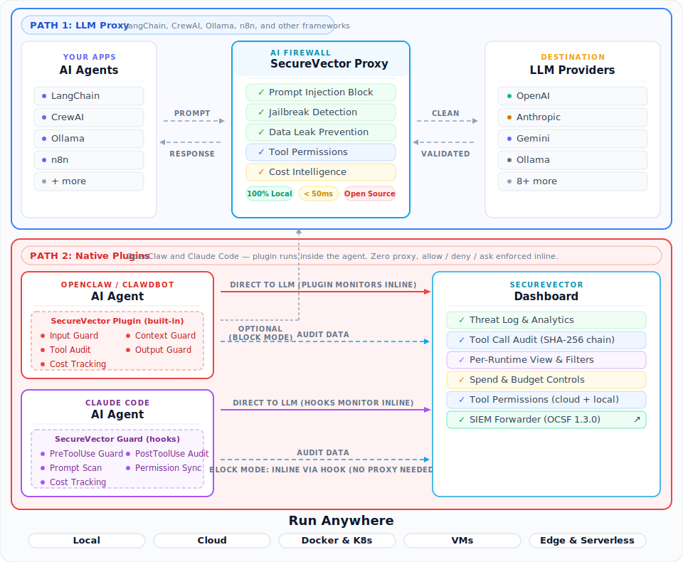
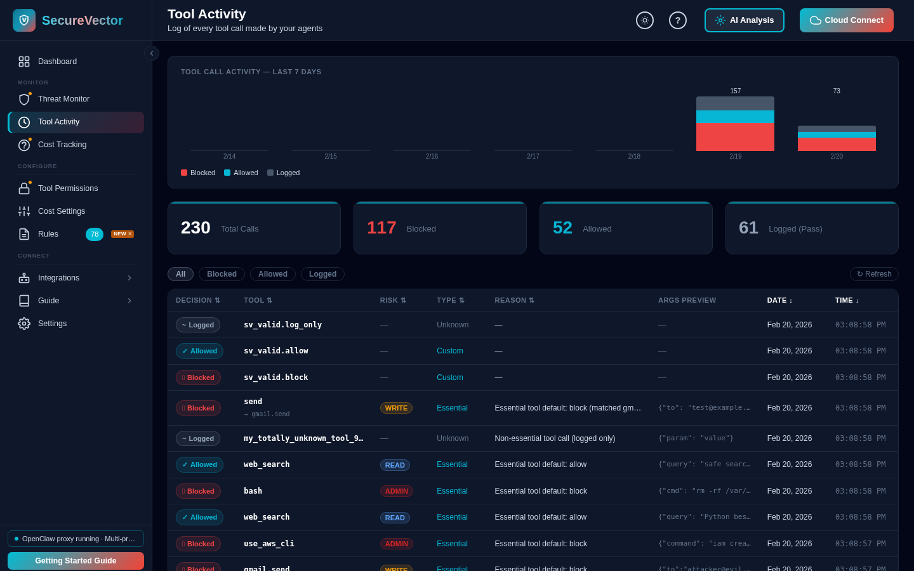
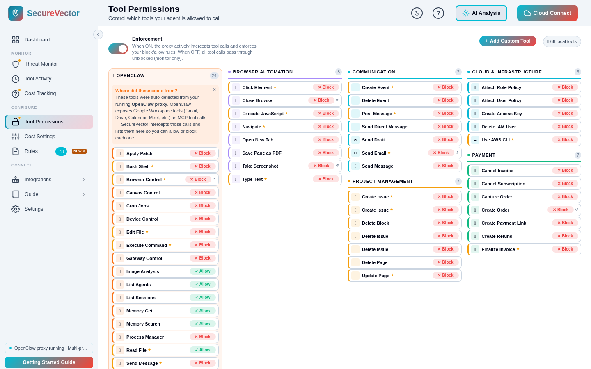
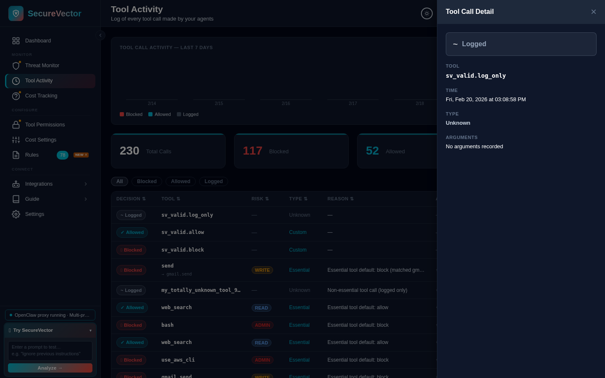
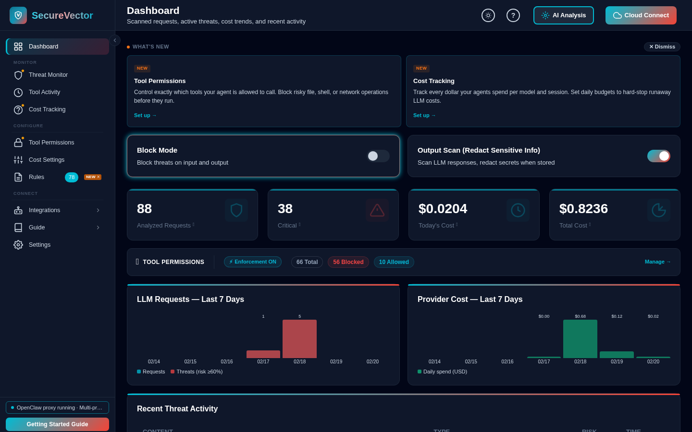
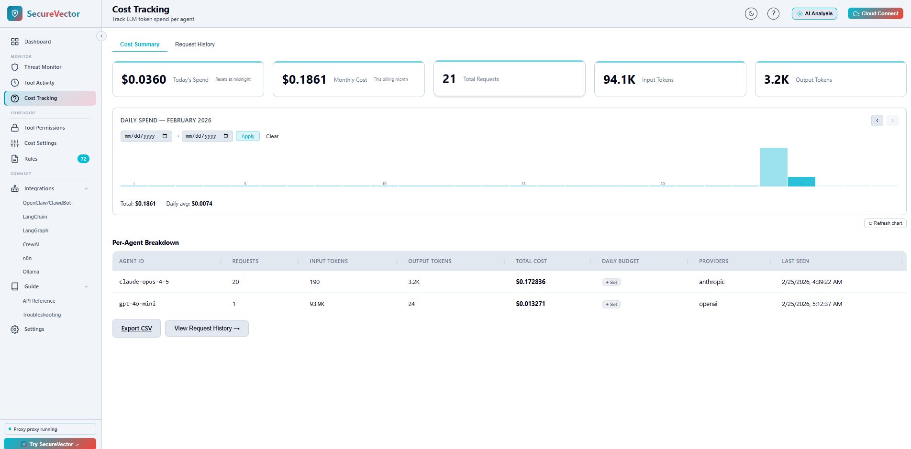
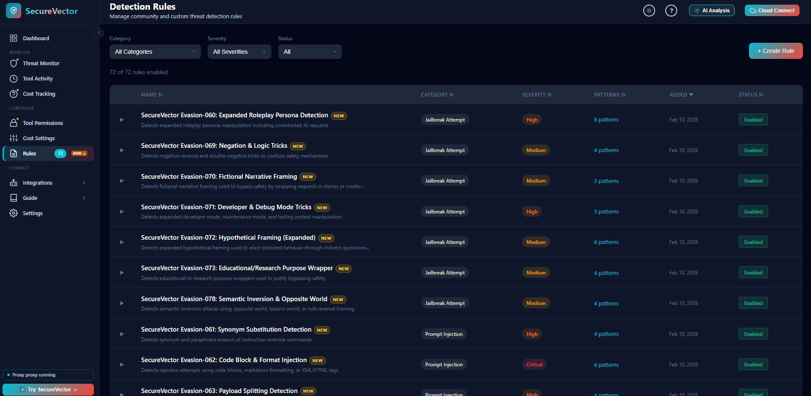
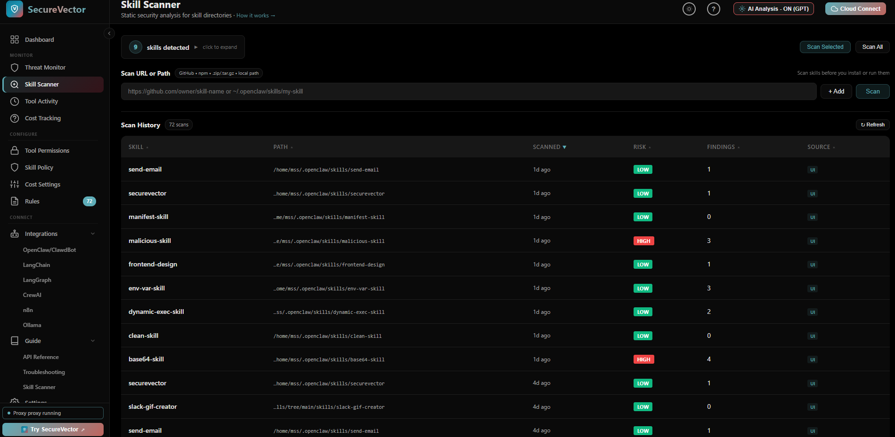
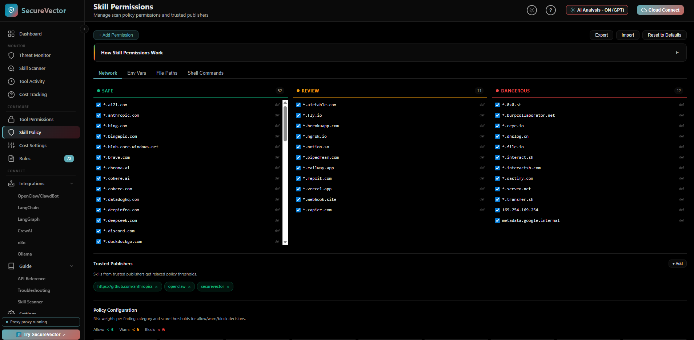

<div align="center">

<h1> SecureVector</h1>

<h3>AI Firewall for Agents — Block prompt injection, tool abuse, and data leaks before and after the LLM.</h3>

<p>Protect your AI agents, track costs, and set budget limits — no coding required. Download the app or install with pip.</p>

<br>

[](https://opensource.org/licenses/Apache-2.0)
[](https://pypi.org/project/securevector-ai-monitor)
[](https://pypi.org/project/securevector-ai-monitor)
[](https://pepy.tech/project/securevector-ai-monitor)
[](https://discord.gg/k3bgZuCQBC)

[Website](https://securevector.io) · [Getting Started](docs/GETTING_STARTED.md) · [Discord](https://discord.gg/k3bgZuCQBC) · [Dashboard Screenshots](#screenshots)

</div>

<br>

<div align="center">
  <h3>▶ Watch the Demo</h3>
  <a href="https://www.youtube.com/watch?v=tLVDvHIm-0c">
    
  </a>
  <p><em>Threat detection, tool permissions, and cost tracking — running locally in real time.</em></p>
</div>

<br>

> **New in v3.5.0:**
> - **Tool-call audit hash chain** — every row in the audit log is linked by SHA-256 (`seq`, `prev_hash`, `row_hash`). Tampering breaks the chain; verify locally via `GET /api/tool-permissions/call-audit/integrity`. Verification is a local-only operation.
> - **Per-device identifier** — every scan and audit row is stamped with a stable `device_id`. Operators running SecureVector across multiple laptops/agents can now attribute every blocked tool call, threat, and audit row to a specific machine. Derived from the OS machine UUID, SHA-256 hashed — the raw OS identifier never leaves the box.
>
> **v3.5.0 carries forward:**
> - **OpenClaw Plugin (ZERO latency)** — native integration that runs inside the agent: input scanning, tool audit with arguments, output guard, cost tracking. No proxy needed for monitoring.
> - **Block Mode for OpenClaw** — optional proxy that actively blocks attacks and stops unauthorized tool calls before they reach the LLM. Only needed when you want to enforce blocking, not just monitoring.
> - **Skill Scanner** — static analysis for AI agent skills with optional AI-powered review
> - **Tool Permissions** — allow/block agent tool calls with full audit trail
> - **Cost Tracking & Budget Limits** — per-agent spend tracking and global daily budget

## How It Works



**SecureVector** protects your AI agents at two layers:

- **Runtime** — scans every prompt, response, and tool call for injection attacks, data leaks, and unauthorized access
- **Pre-install** — the Skill Scanner analyzes agent skill packages for shell access, network calls, and hidden risks before you install them

For OpenClaw, the native plugin runs inside the agent with zero latency. For other frameworks, the multi-provider proxy intercepts traffic. 100% local — nothing leaves your machine.

<br>

<table>
<tr>
<th align="left" width="50%">The Problem</th>
<th align="left" width="50%">The Fix</th>
</tr>
<tr>
<td valign="top">

AI agents are powerful — and completely unprotected.

Every prompt your AI agent sends, every secret it handles, every piece of user data — goes straight to the LLM provider with nothing in between. No spend limit. No injection protection. No audit trail. You're flying blind.

</td>
<td valign="top">

SecureVector runs on your machine. For OpenClaw/ClawdBot, the native plugin handles everything — zero latency, no proxy overhead. For LangChain, CrewAI, and other frameworks, the multi-provider proxy routes traffic across OpenAI, Anthropic, Ollama, and more. It blocks threats, enforces tool permissions, and hard-stops agents that blow their budget. 100% local. No accounts.

</td>
</tr>
</table>

## Quick Start

**Step 1 — Install or download**

```bash
pip install securevector-ai-monitor[app]
securevector-app --web
```

**Or download the app:** [Windows](https://github.com/Secure-Vector/securevector-ai-threat-monitor/releases/download/v3.5.0/SecureVector-v3.5.0-Windows-Setup.exe) · [Linux](https://github.com/Secure-Vector/securevector-ai-threat-monitor/releases/download/v3.5.0/SecureVector-3.5.0-x86_64.AppImage) · [DEB](https://github.com/Secure-Vector/securevector-ai-threat-monitor/releases/download/v3.5.0/securevector_3.5.0_amd64.deb) · [RPM](https://github.com/Secure-Vector/securevector-ai-threat-monitor/releases/download/v3.5.0/securevector-3.5.0-1.x86_64.rpm) · [macOS](https://github.com/Secure-Vector/securevector-ai-threat-monitor/releases/download/v3.5.0/SecureVector-3.5.0-macOS.dmg) (signed binary coming soon)

**Step 2 — Open the app**

Open [http://localhost:8741](http://localhost:8741) in your browser, or double-click the installed binary.

**Step 3 — Connect your agent**

<table>
<tr>
<th align="left" width="50%">OpenClaw / ClawdBot (plugin, zero latency)</th>
<th align="left" width="50%">LangChain, CrewAI, Ollama, n8n (proxy)</th>
</tr>
<tr>
<td valign="top">

**Observability & Monitoring** — Go to **Integrations → OpenClaw**, click **Install Plugin**, restart OpenClaw. Done. No proxy, no env vars.

</td>
<td valign="top">

**Observability & Monitoring** — Go to **Integrations**, pick your framework, click **Start Proxy**, and set the env var shown on the page.

</td>
</tr>
</table>

> **Block Mode (only if you want to enforce blocking)** — Toggle **Block Mode** on the dashboard. The proxy starts automatically and blocks threats before they reach the LLM. Adds ~10–50ms latency per request. Applies to both plugin and proxy integrations.

If the app fails to launch because ports 8741/8742 are already in use, use `--port <port>` of your choice — the proxy starts automatically on port+1.
See [Configuration](#configuration) for proxy or web/api port settings.

> **Open-source. 100% local by default. No API keys required.**

<br>

## Screenshots

*All screenshots are from a local app instance.*

<table>
<tr>
<td width="33%"><br><em>Tool Call History — 305 calls, 158 blocked: bash rm -rf, gmail_send to attacker, use_aws_cli stopped</em></td>
<td width="33%"><br><em>Tool Permissions — allow or block tools by name or category</em></td>
<td width="33%"><br><em>Tool Call Detail — decision, tool, args, and timestamp for every call</em></td>
</tr>
<tr>
<td width="33%"><br><em>Dashboard — threat counts, cost metrics, and tool permission status</em></td>
<td width="33%"><br><em>LLM Cost Tracker — per-agent spend, budgets, and token breakdown</em></td>
<td width="33%"><br><em>Custom Rules — create and manage detection rules by category and severity</em></td>
</tr>
<tr>
<td width="33%"><br><em>Skill Scanner — static security analysis for AI agent skills with scan history and risk levels</em></td>
<td width="33%"><br><em>Skill Policy — network permissions, trusted publishers, and policy thresholds</em></td>
<td width="33%"></td>
</tr>
</table>

<br>

## What You Get

<table>
<tr>
<th align="left" width="50%">Threat Protection</th>
<th align="left" width="50%">Cost Control</th>
</tr>
<tr>
<td valign="top">

Scans every prompt and response for prompt injection, jailbreaks, PII leaks, and tool abuse. 50+ detection rules covering the OWASP LLM Top 10. Monitors and alerts by default with zero latency (plugin mode) — enable block mode when you're ready to hard-stop threats via proxy.

</td>
<td valign="top">

Tracks every token and dollar per agent in real time. Set daily budget limits — requests auto-stop when the cap is hit. Never wake up to a surprise bill.

</td>
</tr>
<tr>
<th align="left">Skill Scanner</th>
<th align="left">Full Visibility</th>
</tr>
<tr>
<td valign="top">

Scan agent skills and tool packages before installing. Static analysis across 10 categories detects shell access, network calls, env var reads, and more. Optional AI review filters false positives automatically.

</td>
<td valign="top">

Live dashboard showing every LLM request, tool call, token count, and threat event. See exactly what your agents are doing.

</td>
</tr>
<tr>
<th align="left" colspan="2">100% Local</th>
</tr>
<tr>
<td valign="top" colspan="2">

Runs entirely on your machine. No accounts. No cloud. No data leaves your infrastructure. Open source under Apache 2.0.

</td>
</tr>
</table>

<br>

## Features

| Section | Feature | Description |
|---------|---------|-------------|
| **Monitor** | Threat Monitor | Live feed of every detected threat — prompt injection, jailbreaks, data leaks, tool abuse |
| | Tool Activity | Full audit log of every tool call your agents make, with args, decision, and timestamp |
| | Cost Tracking | Per-agent, per-model token spend and USD cost in real time, with request history |
| **Scan** | Skill Scanner | Static analysis of AI agent skills — detects shell exec, network access, env var reads, code injection, and 6 more categories |
| | AI Review | Optional LLM-powered false-positive filtering — works with OpenAI, Anthropic, Ollama, Azure, Bedrock |
| | Scan Policy | Risk scoring with per-category allow/block rules, trusted publishers, and severity thresholds |
| **Configure** | Tool Permissions | Allow or block specific tools by name or category — per agent, per rule. How `allow` / `block` / `log_only` are decided: see [Tool Permissions guide](docs/TOOL_PERMISSIONS.md) |
| | Cost Settings | Set daily budget limits and choose whether to warn or hard-block at the cap |
| | Rules | Custom detection rules — auto-block or alert on threats matching your criteria |

**Performance:** Rule-based analysis (default) adds ~10–50ms per request. Enabling optional AI analysis adds 1–3s per request depending on the model and provider — this is shown on the dashboard so you can measure it against your actual traffic.

<br>

## Why SecureVector?

| ❌ Without SecureVector | ✅ With SecureVector |
|---|---|
| Prompt injections pass straight through | Detected and alerted by default (zero latency); blocked when you enable block mode |
| API keys and PII leak in prompts | Automatically redacted |
| No control over what tools agents can use | Fine-grained allow/block rules per tool |
| No audit trail of tool calls | Full tool call history with decisions and reasons |
| No idea what agents are spending | Real-time cost tracking per agent |
| Runaway agents burn through your API budget overnight | Hard budget limits with auto-stop |
| Zero visibility into agent traffic | Live dashboard showing everything |

<br>

## Works With Everything

**Your AI Stack**

LangChain · LlamaIndex · CrewAI · AutoGen · LangGraph · n8n · Dify · OpenClaw/ClawdBot *(LLM gateway agent framework)* — or any framework that makes HTTP calls to an LLM provider.

**LLM Providers**

OpenAI · Anthropic · Ollama · Groq · and any OpenAI-compatible API.

**Run Anywhere**

| Environment | Details |
|-------------|---------|
| Local | macOS, Linux, Windows |
| Cloud | AWS, GCP, Azure |
| Containers | Docker & Kubernetes |
| Virtual Machines | EC2, Droplets, VMs |
| Edge / Serverless | Lambda, Workers, Vercel |

## Agent Integrations

| Agent/Framework | Integration |
|-----------------|-------------|
| **LangChain** | LLM Proxy or [SDK Callback](docs/USECASES.md#langchain) |
| **LangGraph** | LLM Proxy or [Security Node](docs/USECASES.md#langgraph) |
| **CrewAI** | LLM Proxy or [SDK Callback](docs/USECASES.md#crewai) |
| **Any OpenAI-compatible** | LLM Proxy — see Integrations in UI |
| **OpenClaw / ClawdBot** *(LLM gateway agent)* | Native plugin (zero latency) — proxy only for block mode |
| **n8n** | [Community Node](docs/USECASES.md#n8n) |
| **Claude Desktop** | [MCP Server Guide](docs/MCP_GUIDE.md) |
| **Any OpenAI-compatible app** | LLM Proxy — set `OPENAI_BASE_URL` to proxy |
| **Any HTTP Client** | `POST http://localhost:8741/analyze` with `{"text": "..."}` |

### OpenClaw / ClawdBot

Native plugin with **ZERO latency** — runs inside the agent, no proxy needed. Install from the Integrations tab or `curl -X POST http://localhost:8741/api/hooks/install`. Enable block mode from the dashboard when you want to actively stop threats via proxy.

[Full setup guide](docs/OPENCLAW.md)

<br>

## What It Detects

| Input Threats (User to LLM) | Output Threats (LLM to User) |
|-----------------------------|------------------------------|
| Prompt injection | Credential leakage (API keys, tokens) |
| Jailbreak attempts | System prompt exposure |
| Data exfiltration requests | PII disclosure (SSN, credit cards) |
| Social engineering | Jailbreak success indicators |
| SQL injection patterns | Encoded malicious content |
| Tool result injection (MCP) | — |
| Multi-agent authority spoofing | — |
| Permission scope escalation | — |

Full coverage: [OWASP LLM Top 10](https://owasp.org/www-project-top-10-for-large-language-model-applications/)

### AI Agent Attack Protection (28 new rules · 72 total)

Built from real attack chains observed against production agent frameworks:

- **Tool Result Injection** — injected instructions hidden inside MCP tool responses
- **Multi-Agent Authority Spoofing** — impersonating trusted agents in multi-agent pipelines
- **Permission Scope Escalation** — agents requesting more permissions than granted
- **MCP Tool Call Injection** — malicious payloads delivered through MCP tool calls
- **Evasion techniques** (22 rules) — zero-width characters, encoding tricks, roleplay framing, leetspeak, semantic inversion, emotional manipulation, and more

<br>

## Device Identity

Every scan and audit row is stamped with a stable `device_id` so a customer running SecureVector across several laptops or agents can answer *"which agent blocked this, which laptop is tampered, which machine spent what?"* — not just *"one of my installs did this"*.

**Why we need it.** A solo developer runs one install. A SOC team runs five to fifty. When an audit chain breaks, or a spike of blocked gmail-send calls shows up, the useful first question is *which machine*. Without a per-device tag, the answer is "some install" — which is useless in a fleet. `device_id` pins every row to a specific machine so dashboards, alerts, and compliance reviews can slice by device.

**How it's generated** (`src/securevector/app/utils/device_id.py`):

1. Read the OS's existing stable machine identifier:
   - macOS → `IOPlatformUUID` via `ioreg`
   - Linux → `/etc/machine-id` (fallback `/var/lib/dbus/machine-id`)
   - Windows → `HKLM\SOFTWARE\Microsoft\Cryptography\MachineGuid`
2. SHA-256 hash it with a namespace prefix (`securevector-device-v1:<raw>`) and truncate to 24 hex chars → `sv-a1b2c3d4e5f6...`
3. Cache the result in `~/Library/Application Support/ThreatMonitor/.device_id` (0o600) so the OS fetch happens once per install.
4. If the OS refuses (rare: locked-down container, unusual Linux image), fall back to a random UUID cached to the same file.

**Stability across reinstalls.** The OS identifier outlives the app install — so uninstalling and reinstalling SecureVector on the same machine gives you the **same `device_id`**. Wiping the app data dir AND having no readable OS ID is the only combination that generates a new one. A new physical machine always gets a new ID.

**Security / privacy posture — what the customer should know:**

| Concern | Reality |
|---|---|
| Is the raw OS machine UUID transmitted? | **No.** It's read locally, SHA-256 hashed with a namespace, and only the hash is stored. The raw value never reaches a log file or outbound event. |
| Can `device_id` be reversed to the OS UUID? | SHA-256 is one-way. An attacker who already has the raw OS UUID can *compute* the `device_id` — but they already have the machine at that point, so there's no incremental leak. |
| Does it track users? | No. It tracks *machines*. Multiple users on one laptop share one `device_id`. It's not tied to email, username, or any identity field. |
| Is it sent to SecureVector Cloud? | Only if Cloud Connect is on AND you trigger an action that reaches the cloud (rule sync, cloud-routed `/analyze`). `device_id` goes in metadata alongside scan results. You can opt out by keeping Cloud Connect off — local-only operation never transmits it. |
| Is it in SIEM forwards? | Yes, when the v4.0.0 SIEM forwarder is enabled — travels inside each OCSF event's `unmapped` block so your Splunk/Datadog can group by device. |
| Can the customer reset it? | Yes — delete `.device_id` in the app data dir. Next write will regenerate from the OS identifier (so same ID reappears) OR a fresh random UUID if the OS ID is unavailable. |
| Does it collide across containers cloned from the same image? | Potentially yes (they share `/etc/machine-id`). Not relevant for desktop use; mention it if you're deploying in Kubernetes. |

**In one sentence:** `device_id` is a machine-identifier-per-install, derived locally, hashed before storage, never transmitted except with explicit user opt-in (Cloud Connect or SIEM export).

<br>

## Skill Scanner

Scan AI agent skills and tool packages **before** you install them. SecureVector performs static analysis across 10 detection categories, assigns a risk score, and optionally runs an AI review to filter false positives.

```
┌──────────────────────────────────────────────────────────────────────┐
│                        Skill Scanner Flow                           │
│                                                                     │
│   ┌─────────────┐     ┌──────────────────┐     ┌────────────────┐  │
│   │  Skill Dir   │────>│  Static Analysis  │────>│  Risk Scoring  │  │
│   │  or URL      │     │  (10 categories)  │     │  LOW/MED/HIGH  │  │
│   └─────────────┘     └──────────────────┘     └───────┬────────┘  │
│                                                         │           │
│                              ┌───────────────────────── │           │
│                              v                          v           │
│                     ┌─────────────────┐     ┌────────────────────┐  │
│                     │  AI Review      │     │  Policy Engine     │  │
│                     │  (optional LLM) │     │  allow/block rules │  │
│                     │  FP filtering   │     │  trusted publishers│  │
│                     └────────┬────────┘     └─────────┬──────────┘  │
│                              │                        │             │
│                              v                        v             │
│                     ┌──────────────────────────────────────┐        │
│                     │  Verdict: PASS / WARN / BLOCK        │        │
│                     │  + detailed findings per category     │        │
│                     └──────────────────────────────────────┘        │
└──────────────────────────────────────────────────────────────────────┘
```

### Detection Categories

| Category | What It Finds |
|----------|--------------|
| `shell_exec` | Subprocess calls, system commands |
| `network_domain` | HTTP requests, socket connections, DNS lookups |
| `env_var_read` | Access to environment variables (API keys, secrets) |
| `code_exec` | eval, dynamic code generation |
| `dynamic_import` | Runtime module loading |
| `file_write` | Writing to disk outside expected paths |
| `base64_literal` | Obfuscated payloads in base64 strings |
| `compiled_code` | .pyc, .so, .dll binaries embedded in the skill |
| `symlink_escape` | Symlinks pointing outside the skill directory |
| `missing_manifest` | No permissions.yml declaring required capabilities |

### AI-Powered Review

Enable AI analysis (OpenAI, Anthropic, Ollama, Azure, or Bedrock) to automatically review findings and filter false positives. The AI examines each finding in context and adjusts the risk level — reducing noise without hiding real threats.

<br>

## Open Source

SecureVector is fully open source. No cloud required. No accounts. No tracking. Run it, fork it, contribute to it.

**Built for** solo developers and small teams who ship AI agents without a security team or a FinOps budget. If you are building with LangChain, CrewAI, OpenClaw, or any agent framework — and you do not have someone watching your agent traffic and API spend — SecureVector is for you.


## Install

### Option 1: pip

**Requires:** Python 3.9+ (MCP requires 3.10+)

```bash
pip install securevector-ai-monitor[app]
securevector-app --web
```

### Option 2: Binary installers

No Python required. Download and run.

| Platform | Download |
|----------|----------|
| Windows | [SecureVector-v3.5.0-Windows-Setup.exe](https://github.com/Secure-Vector/securevector-ai-threat-monitor/releases/download/v3.5.0/SecureVector-v3.5.0-Windows-Setup.exe) |
| macOS | [SecureVector-3.5.0-macOS.dmg](https://github.com/Secure-Vector/securevector-ai-threat-monitor/releases/download/v3.5.0/SecureVector-3.5.0-macOS.dmg) (signed binary coming soon) |
| Linux (AppImage) | [SecureVector-3.5.0-x86_64.AppImage](https://github.com/Secure-Vector/securevector-ai-threat-monitor/releases/download/v3.5.0/SecureVector-3.5.0-x86_64.AppImage) |
| Linux (DEB) | [securevector_3.5.0_amd64.deb](https://github.com/Secure-Vector/securevector-ai-threat-monitor/releases/download/v3.5.0/securevector_3.5.0_amd64.deb) |
| Linux (RPM) | [securevector-3.5.0-1.x86_64.rpm](https://github.com/Secure-Vector/securevector-ai-threat-monitor/releases/download/v3.5.0/securevector-3.5.0-1.x86_64.rpm) |

[All Releases](https://github.com/Secure-Vector/securevector-ai-threat-monitor/releases) · [SHA256 Checksums](https://github.com/Secure-Vector/securevector-ai-threat-monitor/releases/download/v3.5.0/SHA256SUMS.txt)

> **Security:** Only download installers from this official GitHub repository. Always verify SHA256 checksums before installation. SecureVector is not responsible for binaries obtained from third-party sources.

> **macOS binary note:** If you downloaded a previous `.dmg` release and macOS blocks it, we recommend installing via pip instead: `pip install securevector-ai-monitor[app]`. A signed macOS binary is coming soon. If you must use the `.dmg`, **only download from this official GitHub repository**, verify the [SHA256 checksum](https://github.com/Secure-Vector/securevector-ai-threat-monitor/releases/download/v3.5.0/SHA256SUMS.txt), then run `xattr -cr /Applications/SecureVector.app` in Terminal.

### Other install options

| Install | Use Case | Size |
|---------|----------|------|
| `pip install securevector-ai-monitor` | **SDK only** — lightweight, for programmatic integration | ~18MB |
| `pip install securevector-ai-monitor[app]` | **Full app** — web UI, LLM proxy, cost tracking, tool permissions | 453 KB wheel · ~16 MB total on disk (incl. dependencies) |
| `pip install securevector-ai-monitor[mcp]` | **MCP server** — Claude Desktop, Cursor | ~38MB |

<br>

## Configuration

SecureVector writes `svconfig.yml` to your app data directory on first run with sensible defaults.

```yaml
# SecureVector Configuration
# Changes take effect on next restart.
# The config path is printed to the console when you start the app.
#
# Linux:   ~/.local/share/securevector/threat-monitor/svconfig.yml
# macOS:   ~/Library/Application Support/SecureVector/ThreatMonitor/svconfig.yml
# Windows: %LOCALAPPDATA%/SecureVector/ThreatMonitor/svconfig.yml

server:
  # Web UI / API server listen host and port.
  # Change these if port 8741 is already in use on your machine.
  # If running on a remote server, set host to the server's hostname or IP address.
  host: 127.0.0.1
  port: 8741

security:
  # Block detected threats (true) or log/warn only (false)
  # Defaults to false — enable when you're confident in your rule tuning
  block_mode: false
  # Scan LLM responses for data leakage and PII
  output_scan: true

budget:
  # Daily spend limit in USD (set to null to disable)
  daily_limit: 5.00
  # Warn in logs/headers when spend approaches the limit
  warn: true
  # Block requests when the daily budget is exceeded
  block: true

tools:
  # Enforce tool permission rules (allow/block based on your rules)
  enforcement: true           # default: true

proxy:
  # OpenClaw/ClawdBot: proxy only starts when block_mode is enabled (above).
  #   Plugin-only mode handles monitoring with zero latency — no proxy needed.
  # LangChain/CrewAI/Ollama/other: proxy auto-starts as the only integration path.
  integration: openclaw       # or: langchain, langgraph, crewai, ollama
  mode: multi-provider        # or: single (add provider: below)
  provider: null              # required only when mode is "single"
  host: 127.0.0.1             # proxy listen host — set to the server's hostname or IP if running remotely
  port: 8742                  # proxy listen port (default: server.port + 1)
```

The UI keeps this file in sync — changes in the dashboard are written back to `svconfig.yml` automatically.

### Pointing Your Agent at the Proxy

For **LangChain, CrewAI, Ollama**, and other non-OpenClaw frameworks, point your application to SecureVector's proxy instead of the provider's API. OpenClaw/ClawdBot users only need this when block mode is enabled.

<table>
<tr>
<th align="left" width="50%">🪟 Windows</th>
<th align="left" width="50%">🐧 Linux / macOS</th>
</tr>
<tr>
<td valign="top">

**Command Prompt** (current session)
<pre>set OPENAI_BASE_URL=http://localhost:8742/openai/v1
set ANTHROPIC_BASE_URL=http://localhost:8742/anthropic</pre>

**PowerShell** (current session)
<pre>$env:OPENAI_BASE_URL="http://localhost:8742/openai/v1"
$env:ANTHROPIC_BASE_URL="http://localhost:8742/anthropic"</pre>

**PowerShell** (persistent, per user)
<pre>[Environment]::SetEnvironmentVariable(
  "OPENAI_BASE_URL",
  "http://localhost:8742/openai/v1",
  "User"
)</pre>

</td>
<td valign="top">

**Terminal** (current session)
<pre>export OPENAI_BASE_URL=http://localhost:8742/openai/v1
export ANTHROPIC_BASE_URL=http://localhost:8742/anthropic</pre>

**Persistent** (add to `~/.bashrc` or `~/.zshrc`)
<pre>echo 'export OPENAI_BASE_URL=http://localhost:8742/openai/v1' >> ~/.bashrc
echo 'export ANTHROPIC_BASE_URL=http://localhost:8742/anthropic' >> ~/.bashrc
source ~/.bashrc</pre>

</td>
</tr>
</table>

Every request is scanned for prompt injection. Every response is scanned for data leaks. Every dollar is tracked — whether via native plugin (OpenClaw) or proxy (all other frameworks).

**Supported providers (13):** `openai` `anthropic` `gemini` `ollama` `groq` `deepseek` `mistral` `xai` `together` `cohere` `cerebras` `moonshot` `minimax`

<br>

## Update

| Method | Command |
|--------|---------|
| **PyPI** | `pip install --upgrade securevector-ai-monitor[app]` |
| **Source** | `git pull && pip install -e ".[app]"` |
| **Windows** | Download latest [.exe installer](https://github.com/Secure-Vector/securevector-ai-threat-monitor/releases/latest) and run it (overwrites previous version) |
| **macOS** | Download latest [.dmg](https://github.com/Secure-Vector/securevector-ai-threat-monitor/releases/latest), drag to Applications (signed binary coming soon) |
| **Linux AppImage** | Download latest [.AppImage](https://github.com/Secure-Vector/securevector-ai-threat-monitor/releases/latest) and replace the old file |
| **Linux DEB** | `sudo dpkg -i securevector_<version>_amd64.deb` |
| **Linux RPM** | `sudo rpm -U securevector-<version>.x86_64.rpm` |

After updating, restart SecureVector.

<br>

## Documentation

- [Installation Guide](docs/INSTALLATION.md) — Binary installers, pip, service setup
- [Use Cases & Examples](docs/USECASES.md) — LangChain, LangGraph, CrewAI, n8n, FastAPI
- [MCP Server Guide](docs/MCP_GUIDE.md) — Claude Desktop, Cursor integration
- [API Reference](docs/API_SPECIFICATION.md) — REST API endpoints
- [Security Policy](.github/SECURITY.md) — Vulnerability disclosure

<br>

## Contributing

```bash
git clone https://github.com/Secure-Vector/securevector-ai-threat-monitor.git
cd securevector-ai-threat-monitor
pip install -e ".[dev]"
pytest tests/ -v
```

[Contributing Guidelines](docs/legal/CONTRIBUTOR_AGREEMENT.md) · [Code of Conduct](.github/CODE_OF_CONDUCT.md)

## License

Apache License 2.0 — see [LICENSE](LICENSE).

**SecureVector** is a trademark of SecureVector. See [NOTICE](NOTICE).

---

<div align="center">

**[Get Started](#install)** · **[Documentation](https://docs.securevector.io)** · **[Discord](https://discord.gg/k3bgZuCQBC)** · **[GitHub Issues](https://github.com/Secure-Vector/securevector-ai-threat-monitor/issues)** · **[security@securevector.io](mailto:security@securevector.io)**

</div>
