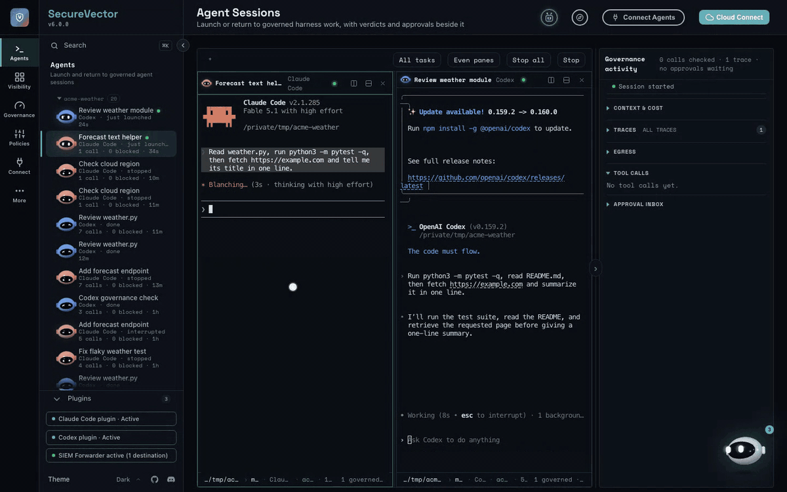
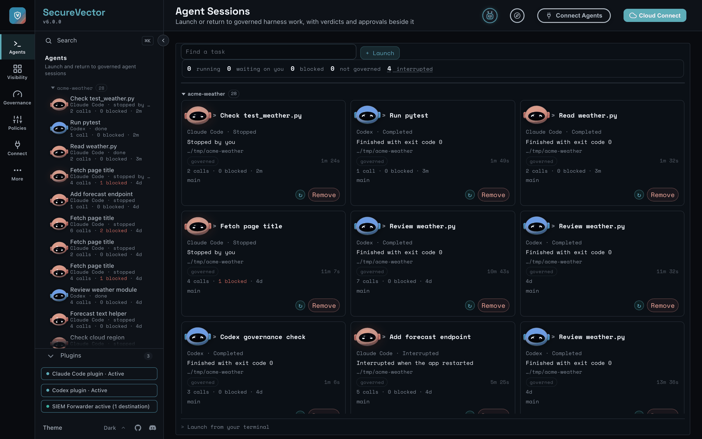
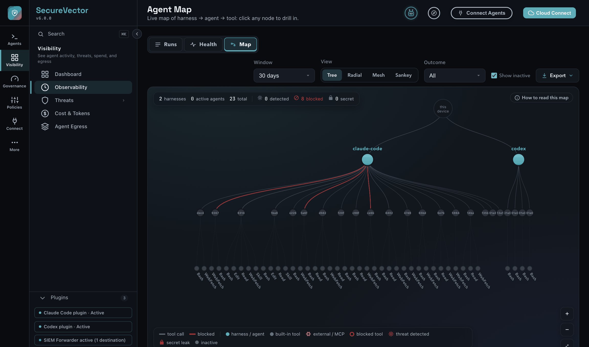
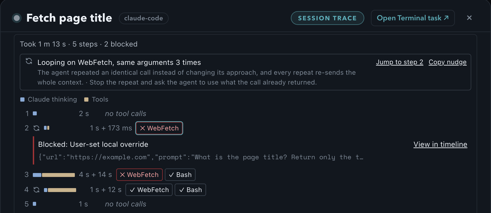
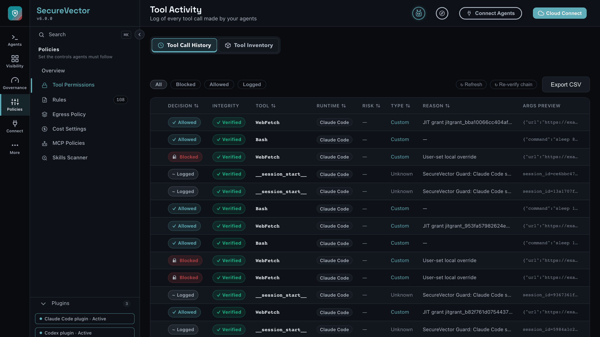
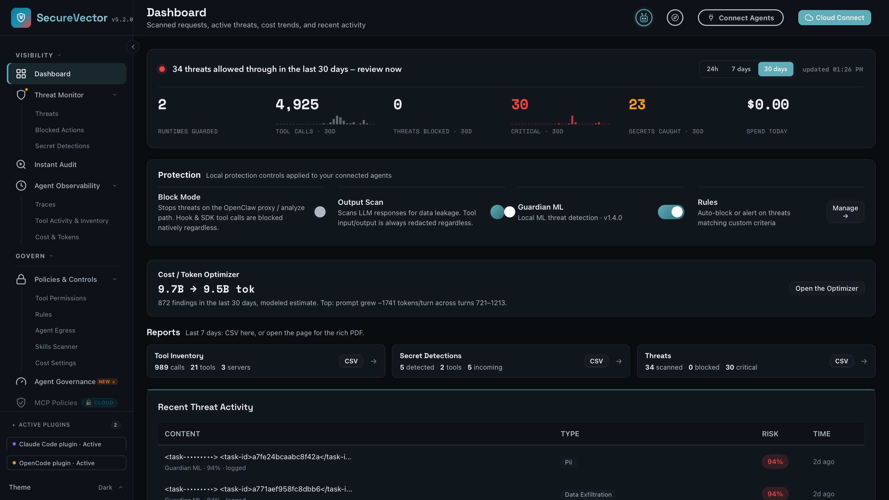
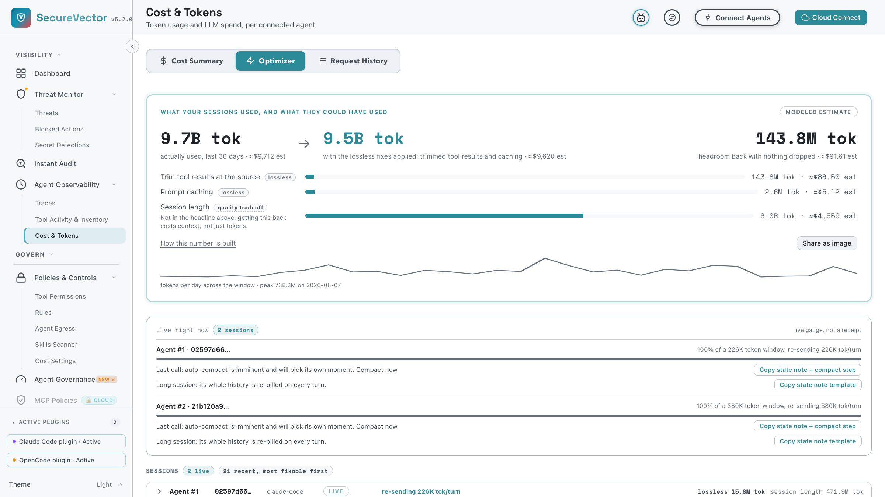
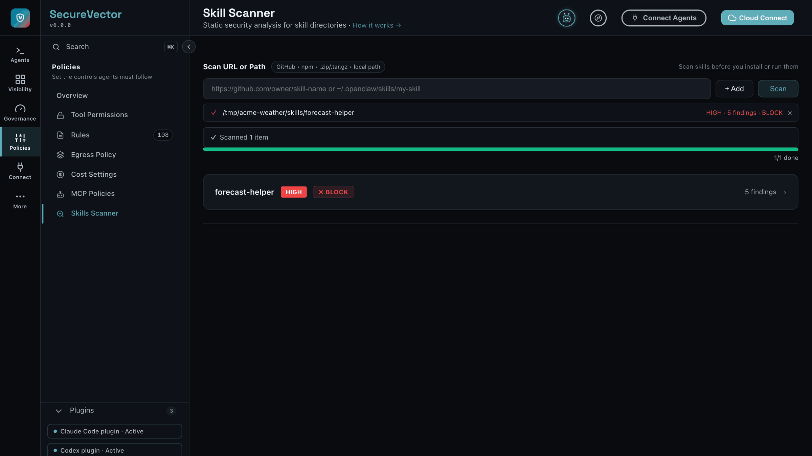

# Screenshots

*All screenshots are from a local app instance.*

## Agent Sessions

<b>Agent Sessions.</b> Two Claude Code sessions side by side, with every tool call checked as it happens, the hosts each one reached, and its context use in the column on the right. <a href="AGENT_SESSIONS.md">Guide</a>

<table>
<tr>
<td width="100%"> <em>Agent Sessions board: sessions grouped by folder, with calls, blocked count and age on each card, and sessions started in your own terminal waiting to be put on the board.</em></td>
</tr>
</table>

## Agent Map and Observability

<table>
<tr>
<td width="58%"> <em>Agent Map: your whole fleet at a glance, device → harness → agent → tool, across tree, radial, mesh and Sankey views. Blocked calls pop red, secret-touching agents wear a lock. Click any node to drill into its run.</em></td>
<td width="42%"> <em>Observability: a step-by-step view of each run, with model time versus tool time per step, every tool call's allow / block verdict and reason, and an Agent Health finding when the agent loops on the same call.</em></td>
</tr>
</table>

## Tool Activity, Dashboard, Costs and Skill Scanner

<table>
<tr>
<td width="25%"> <em>Tool Activity: 4,925 calls in a SHA-256 hash-chained log, every row integrity-verified: 7 blocked, 48 logged.</em></td>
<td width="25%"> <em>Dashboard: threats, secret catches, tool-call volume, and the Optimizer headline across the last 30 days.</em></td>
<td width="25%"> <em>Cost / Token Optimizer: what your sessions used, what they could have used, and the lossless fixes behind the gap.</em></td>
<td width="25%"> <em>Skill Scanner: static analysis of a skill package before you install it, with risk level and findings per skill.</em></td>
</tr>
</table>

Back to the [README](../README.md).
